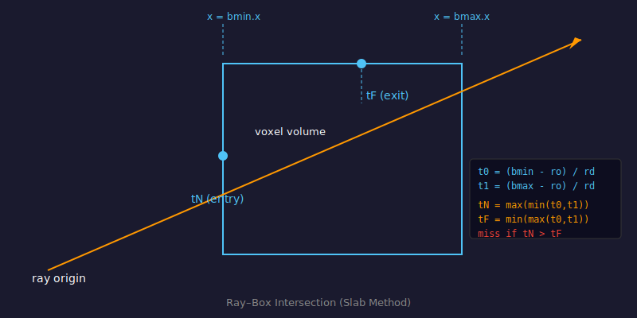
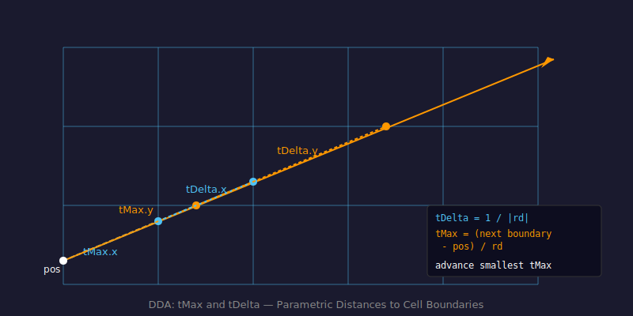

# DDA Raymarching

## Problem

A voxel scene has no triangles — it's a 3D grid of cells, each either empty or solid. A normal polygon renderer can't draw it. We need a different strategy: for each pixel on screen, we shoot a ray into the grid and ask "what is the first solid cell this ray hits?"

---

## Concept

**Digital Differential Analysis (DDA)** is an algorithm that steps a ray through a grid, one cell at a time, always advancing to the nearest cell boundary. Because we advance the minimum distance needed to cross into the next cell, we never skip a cell and never waste steps inside a cell we've already visited.

```
     │   │   │   │   │
  ───┼───┼───┼───┼───┼───
     │   │ ↗ │   │   │
  ───┼───┼───┼───┼───┼───
     │   │   │ ↗ │ ■ │    ← hit
  ───┼───┼───┼───┼───┼───
     │   │   │   │   │
```

Each `↗` step is the smallest advance that brings the ray from one cell into a neighbouring cell. When we land in a solid cell (`■`), we stop and shade that surface.

---

## Ray–Box Intersection

Before we start stepping, we need to know if the ray hits the voxel volume at all, and if so, where it enters. We intersect the ray with the bounding box of the grid using the slab method.



For a ray `p = origin + t * direction`:

- For each axis, compute the two distances `t` where the ray crosses the near and far faces of the box:
  ```
  t0 = (bmin - origin) / direction
  t1 = (bmax - origin) / direction
  ```
- `tN = max(min(t0, t1) per axis)` — the entry distance (ray is inside all three slabs)
- `tF = min(max(t0, t1) per axis)` — the exit distance

If `tN > tF`, the ray misses the box entirely. Otherwise, the ray travels inside the box from `tN` to `tF`.

**Code:** `rayBoxIntersection()` in `js/shaders/main.js:56` and `js/shaders/shadow.js:23`

---

## DDA Step Loop

Once we have the entry point, we initialize the DDA state:

```
pos    = origin + direction * max(tN, 0)      // entry point into the box
voxel  = floor(pos)                           // which cell we're in
stepDir = sign(direction)                     // which direction we advance per axis
tMax   = distance to the next boundary on each axis
tDelta = distance between consecutive boundaries on each axis (= 1 / |direction|)
```



Each iteration we pick the axis with the smallest `tMax` — that's the next boundary the ray crosses — advance `voxel` by `stepDir` on that axis, and add `tDelta` to `tMax` on that axis.

```glsl
// from js/shaders/main.js:98
for(int i = 0; i < 1024; i++){
    // out-of-bounds check → break
    // sample voxel at current cell
    // if solid → shade and return
    // advance: pick axis with smallest tMax
    if(tMax.x < tMax.y){
        if(tMax.x < tMax.z){ voxel.x += stepDir.x; tMax.x += tDelta.x; }
        else                { voxel.z += stepDir.z; tMax.z += tDelta.z; }
    } else {
        if(tMax.y < tMax.z){ voxel.y += stepDir.y; tMax.y += tDelta.y; }
        else                { voxel.z += stepDir.z; tMax.z += tDelta.z; }
    }
}
```

The surface normal is the inverse of the last step direction: if we stepped `+x` to enter the hit cell, the normal faces `-x`.

---

## Vertex Shader Setup

The vertex shader runs once per corner of the box mesh that wraps the grid. It computes the ray origin (camera position in object space) and the ray direction (mesh surface position minus origin).

```glsl
// js/shaders/main.js:25
vOrigin    = vec3(inverse(modelMatrix) * vec4(cameraPosition, 1.0));
vDirection = position - vOrigin;
```

The fragment shader interpolates these across the face and normalizes `vDirection` to get a unit-length ray direction per pixel.

---

## Math Summary

| Symbol | Meaning |
|--------|---------|
| `p = o + t*d` | Ray equation — position at distance `t` along direction `d` from origin `o` |
| `tMax[axis]` | Parametric distance to the next grid boundary on this axis |
| `tDelta[axis]` | Parametric distance between consecutive grid boundaries: `1 / \|d[axis]\|` |
| `stepDir` | `sign(d)` — whether each axis increments or decrements |

---

## Code References

| File | Lines | What's there |
|------|-------|-------------|
| `js/shaders/main.js` | 25–32 | Vertex shader — ray origin and direction setup |
| `js/shaders/main.js` | 56–65 | `rayBoxIntersection()` — slab method |
| `js/shaders/main.js` | 73–168 | Fragment shader — full DDA loop and shading |
| `js/shaders/shadow.js` | 23–32 | `rayBoxIntersection()` (copy in shadow shader) |
| `js/shaders/shadow.js` | 56–78 | Shadow DDA loop |
| `js/config.js` | 1–3 | `W`, `H`, `D` — grid dimensions |

---

## Key Parameters

| Parameter | Effect |
|-----------|--------|
| `W` × `H` × `D` | Directly controls max DDA steps per ray — larger grid = more work per pixel |
| Hard-coded loop bound `1024` | Safety cap; rays exit the box before reaching this in all realistic configurations |

---

## Further Reading

- [Scratchapixel — Ray-Box Intersection](https://www.scratchapixel.com/lessons/3d-basic-rendering/minimal-ray-tracer-rendering-simple-shapes/ray-box-intersection)
- [Wikipedia — Digital differential analyzer](https://en.wikipedia.org/wiki/Digital_differential_analyzer_(graphics_algorithm))
- [A Fast Voxel Traversal Algorithm — Amanatides & Woo (1987)](http://www.cse.yorku.ca/~amana/research/grid.pdf)
