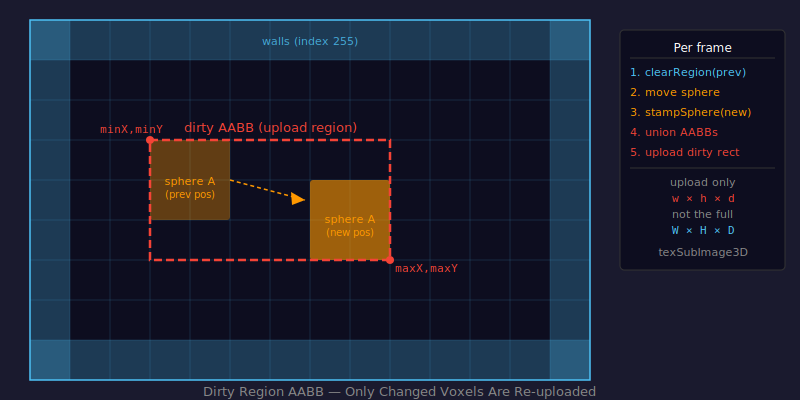

# Dirty Region Uploads

## Problem

The voxel grid lives in two places simultaneously: a `Uint8Array` in CPU memory and a 3D texture on the GPU. Every time a sphere moves, the GPU texture must reflect the change.

The naive approach — upload the entire grid every frame — costs:

```
320 × 200 × 200 × 1 byte = 12.8 MB/frame
```

At 60 fps that's 768 MB/s of CPU→GPU bandwidth just for voxel data, before any rendering work begins.

Spheres occupy a small fraction of the grid and move at most a few voxels per frame. Only the voxels that actually changed need to be re-uploaded.

---

## Concept

Track the **axis-aligned bounding box (AABB)** of everything that changed — the union of each sphere's old footprint and new footprint. Upload only that rectangular sub-region to the GPU using `texSubImage3D`.



An AABB is defined by its minimum and maximum corners:

```
AABB = { minX, minY, minZ, maxX, maxY, maxZ }
```

The union of two AABBs is the smallest AABB that contains both:

```
union.min = min(a.min, b.min)  per axis
union.max = max(a.max, b.max)  per axis
```

---

## Per-Frame Update Loop

Each frame, `updateEntities()` in `js/entities.js` does the following for every sphere:

1. **Compute old AABB** — bounds of the sphere's previous position
2. **Clear old footprint** — zero-fill that region in `voxelData` using `clearRegion()`
3. **Move sphere** — add velocity, clamp and bounce off walls
4. **Stamp new footprint** — fill the sphere's new position with its palette index using `stampSphere()`
5. **Compute new AABB** — bounds of the sphere's new position
6. **Accumulate dirty region** — union of all old and new AABBs across all spheres

```js
// js/entities.js:48
export function updateEntities(entities, voxelData) {
    // clear previous frame's footprints
    if (prevDirtyBounds) clearRegion(voxelData, prevDirtyBounds, W, H);

    let dirtyBounds = null;
    entities.forEach(e => {
        const oldBounds = entityBounds(px, py, pz, e.size, W, H, D);
        dirtyBounds = dirtyBounds ? unionBounds(dirtyBounds, oldBounds) : oldBounds;
        // move, clamp, bounce...
        stampSphere(voxelData, npx, npy, npz, e.size, e.color, W, H, D);
        dirtyBounds = unionBounds(dirtyBounds, newBounds);
    });

    prevDirtyBounds = dirtyBounds;
    return dirtyBounds;
}
```

---

## GPU Upload

The `uploadDirtyRegion()` function in `js/textures.js:58` is the fine-grained upload path — it copies only the dirty AABB sub-region into a scratch buffer, then calls `texSubImage3D` with the exact offset and dimensions:

```js
gl.texSubImage3D(
    gl.TEXTURE_3D, 0,
    minX, minY, minZ,   // offset into the texture
    w, h, d,            // sub-region dimensions
    gl.RED, gl.UNSIGNED_BYTE, scratchBuffer, 0
);
```

In `js/main.js`, the current implementation uses Three.js's `dataTexture.needsUpdate = true`, which re-uploads the full texture. The `uploadDirtyRegion` path was found to bypass an internal Three.js compute step, causing all textures to become invisible. The full AABB infrastructure remains in place; `needsUpdate = true` is the intentional workaround.

---

## AABB Helpers

| Function | File | What it does |
|----------|------|-------------|
| `entityBounds(px, py, pz, r, W, H, D)` | `js/voxel-math.js:40` | Returns the AABB of a sphere at position `(px,py,pz)` with radius `r`, clamped to grid bounds |
| `unionBounds(a, b)` | `js/voxel-math.js:54` | Returns the smallest AABB containing both `a` and `b` |
| `clearRegion(voxelData, bounds, W, H)` | `js/voxel-math.js:70` | Zero-fills a rectangular sub-region of the grid array |
| `uploadDirtyRegion(gl, glTexture, voxelData, scratchBuffer, dirty, W, H)` | `js/textures.js:58` | Copies the dirty AABB sub-region and uploads via `texSubImage3D` |
| `allocateScratchBuffer(W, H, D)` | `js/textures.js:39` | Allocates a reusable `Uint8Array` sized to the full volume |

---

## Code References

| File | Lines | What's there |
|------|-------|-------------|
| `js/voxel-math.js` | 40–48 | `entityBounds()` |
| `js/voxel-math.js` | 54–63 | `unionBounds()` |
| `js/voxel-math.js` | 70–79 | `clearRegion()` |
| `js/textures.js` | 39–41 | `allocateScratchBuffer()` |
| `js/textures.js` | 58–77 | `uploadDirtyRegion()` — `texSubImage3D` call |
| `js/entities.js` | 48–93 | `updateEntities()` — AABB accumulation loop |
| `js/main.js` | 36–40 | Dirty flag and texture upload per frame |

---

## Key Properties

- Upload size is proportional to sphere radius and velocity — small slow spheres cost very little
- The dirty AABB is the union across all spheres, so clustered spheres are cheaper than spread-out ones
- Wall voxels (index `0` and boundary faces) are never inside any entity AABB and are never touched by `clearRegion`

---

## Further Reading

- [MDN — texSubImage3D](https://developer.mozilla.org/en-US/docs/Web/API/WebGL2RenderingContext/texSubImage3D)
- [Wikipedia — Minimum bounding box](https://en.wikipedia.org/wiki/Minimum_bounding_box)
