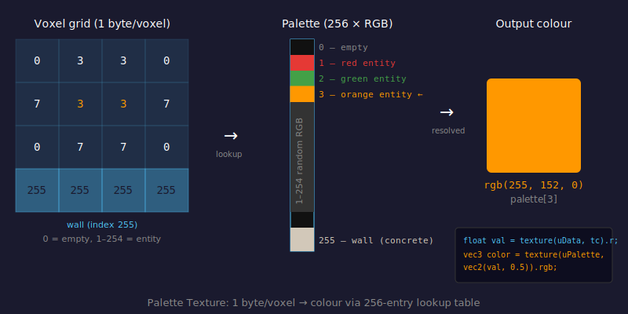

# Palette Textures

## Problem

The voxel grid at high quality is 320×200×200 = 12.8 million voxels. Storing a full RGB colour per voxel would cost 3 bytes × 12.8M = **38 MB** just for colour data, in addition to the geometry data. Uploading and sampling a texture that large every frame would be prohibitive.

More importantly, most voxels in the scene share a small set of colours: each sphere has one solid colour, and the walls are all the same concrete grey. Storing a unique RGB per voxel is wasteful.

---

## Concept

Use a **palette** (also called an indexed colour system or colour lookup table):

- Store **1 byte per voxel** — a palette index from 0 to 255
- Store a separate **256-entry table** (the palette) mapping each index to an RGB colour
- On the GPU, look up the colour in the table using the index value

This reduces the grid from 3 bytes/voxel to 1 byte/voxel — a 3× saving. At 320×200×200, the grid data is 12.8 MB instead of 38.4 MB. The palette itself is only 256 × 4 bytes = 1 KB.



---

## Data Layout

### Voxel data texture

A 3D texture with one 8-bit red channel per texel — `THREE.RedFormat`, `THREE.UnsignedByteType`. Each value is a palette index:

| Index | Meaning |
|-------|---------|
| `0` | Empty (transparent / air) |
| `1`–`254` | Entity colours (random RGB, assigned per sphere) |
| `255` | Wall / floor / ceiling (warm concrete: `rgb(210, 200, 185)`) |

**Code:** `createDataTexture()` in `js/textures.js:4`

### Palette texture

A 1D texture, 256 pixels wide, 1 pixel tall — `THREE.DataTexture`, `THREE.RGBAFormat`. Entry `i` holds the RGBA colour for palette index `i`.

**Code:** `createPaletteTexture()` in `js/textures.js:16`

---

## GPU Lookup

In the fragment shader, once the DDA loop finds a solid voxel, the colour is resolved in two texture reads:

```glsl
// js/shaders/main.js:104–108
vec3 tc = (vec3(voxel) + 0.5) / uVolumeSize;  // voxel → 3D UV
float val = texture(uData, tc).r;              // read palette index (normalised 0–1)

if(val > 0.0){
    vec3 baseColor = texture(uPalette, vec2(val, 0.5)).rgb;  // index → RGB
```

`val` comes back as a float in `[0, 1]` because of how WebGL normalises 8-bit textures. Using it directly as a 1D texture U coordinate maps the index back to the correct palette entry.

---

## Entity Colour Assignment

Each sphere is assigned a random palette index at creation time:

```js
// js/entities.js:32
color: Math.floor(Math.random() * 254) + 1,  // indices 1–254
```

Index `0` (empty) and `255` (wall) are reserved and never assigned to entities. The sphere's `color` index is passed to `stampSphere()`, which fills all voxels in the sphere with that index.

---

## Code References

| File | Lines | What's there |
|------|-------|-------------|
| `js/textures.js` | 4–13 | `createDataTexture()` — 3D RED uint8 texture allocation |
| `js/textures.js` | 16–33 | `createPaletteTexture()` — 256-entry RGBA table, wall colour set at index 255 |
| `js/entities.js` | 32 | Random palette index assigned per entity |
| `js/entities.js` | 9–22 | `initWalls()` — stamps index `255` into all boundary voxels |
| `js/shaders/main.js` | 104–108 | Dual-texture lookup: 3D → index → colour |

---

## Key Parameters

| Index | Reserved for |
|-------|-------------|
| `0` | Empty voxel (air) |
| `1`–`254` | Entity colours |
| `255` | Wall / floor / ceiling (warm concrete `rgb(210, 200, 185)`) |

---

## Further Reading

- [MDN — texSubImage3D](https://developer.mozilla.org/en-US/docs/Web/API/WebGL2RenderingContext/texSubImage3D)
- [Wikipedia — Palette (computing)](https://en.wikipedia.org/wiki/Palette_(computing))
