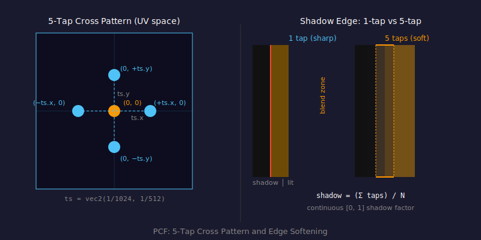

# Percentage Closer Filtering (PCF)

## Problem

A single shadow map sample produces a binary result: the surface is either fully lit or fully in shadow. When the shadow map texel is larger than a screen pixel — which happens near shadow edges — this produces a jagged, aliased boundary.

```
Without PCF:         With PCF:
████░░░░░░           ████▓▒░░░░
████░░░░░░     →     ████▓▒░░░░
████░░░░░░           ███▓▒░░░░░
████░░░░░░           ███▓▒░░░░░
```

---

## Concept

**Percentage Closer Filtering** takes multiple shadow map samples at slightly different UV offsets around the lookup point. Each sample gives a binary in/out result. The average of all samples becomes a continuous shadow factor between 0 (fully shadowed) and 1 (fully lit).

If 3 of 5 samples say "in shadow", the surface receives 40% of the light. This blurs the shadow edge without blurring the depth values themselves (which would produce incorrect results).



---

## 5-Tap Cross Pattern

This renderer uses a 5-tap cross pattern: one center sample and four cardinal-direction neighbours.

```
      (0, +ts.y)
         │
(-ts.x, 0) ─── (0, 0) ─── (+ts.x, 0)
         │
      (0, -ts.y)
```

The step size `ts` is one shadow map texel: `vec2(1.0 / 256.0, 1.0 / 128.0)` (matching the `1024×512` shadow map dimensions, after accounting for equirectangular compression near the poles at UV `y=0.5`).

**Code:** The offsets are defined in `js/shaders/main.js:5–7`:

```js
const offsets = pcfTaps === 1
    ? ['vec2(0.0, 0.0)']
    : ['vec2(0.0, 0.0)', 'vec2( ts.x, 0.0)', 'vec2(-ts.x, 0.0)',
       'vec2(0.0,  ts.y)', 'vec2(0.0, -ts.y)'];
```

---

## Compile-Time Unrolling

GLSL requires sampler arrays to be indexed with constant expressions. A runtime loop like `for (int i = 0; i < N_LIGHTS; i++) { texture(uShadowMap[i], ...) }` is illegal.

Instead, the shader is generated at startup using JavaScript template literals that emit explicit `if/else if` blocks — one per light, one per tap:

```js
// js/shaders/main.js:genShadowSamplerUnroll()
if(l == 0) {
    shadow += step(plDist - bias, texture(uShadowMap[0], shadowUV + vec2(0.0, 0.0)).r);
    shadow += step(plDist - bias, texture(uShadowMap[0], shadowUV + vec2( ts.x, 0.0)).r);
    // ... 3 more taps
} else if(l == 1) {
    // ... 5 taps for light 1
}
shadow /= 5.0;
```

When `SHADOW_PCF_TAPS = 1`, only the center sample is emitted, halving the number of texture reads per light.

---

## Math

Given `N` tap results, each either `0.0` (blocked) or `1.0` (clear):

```
shadow_factor = (tap_0 + tap_1 + ... + tap_N-1) / N
```

This is a linear average of boolean values — it gives the percentage of taps that were not occluded, hence the name "Percentage Closer Filtering".

The final light contribution scales by this factor:

```glsl
// js/shaders/main.js:136
light += uPointLightColor[l] * plNDotL * att * 3.0 * shadow;
```

---

## Code References

| File | Lines | What's there |
|------|-------|-------------|
| `js/shaders/main.js` | 1–19 | `genShadowSamplerUnroll()` — generates PCF code at startup |
| `js/shaders/main.js` | 119–138 | PCF execution in the fragment shader lighting loop |
| `js/config.js` | 12 | `SHADOW_PCF_TAPS` — 1 (sharp) or 5 (soft) |

---

## Key Parameters

| Value | Effect |
|-------|--------|
| `SHADOW_PCF_TAPS = 1` | One sample per light — sharp shadows, fastest |
| `SHADOW_PCF_TAPS = 5` | Five samples per light — soft shadow edges, 5× more shadow texture reads |

---

## Further Reading

- [LearnOpenGL — PCF](https://learnopengl.com/Advanced-Lighting/Shadows/Shadow-Mapping) (see "PCF" section)
- [Wikipedia — Texture filtering](https://en.wikipedia.org/wiki/Texture_filtering)
