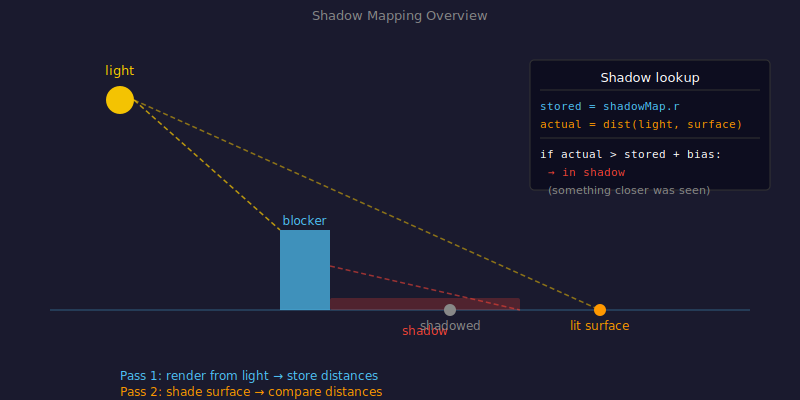
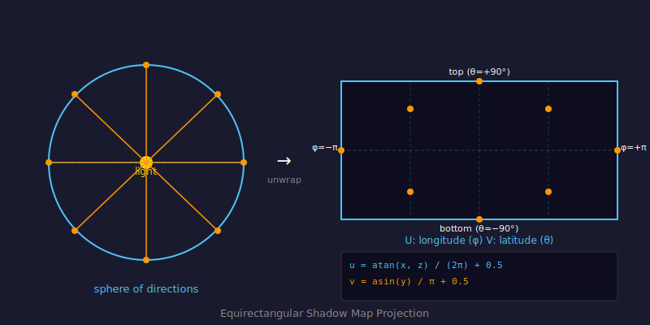

# Shadow Mapping

## Problem

When a point light illuminates a voxel surface, we need to know whether a solid voxel is blocking the path between the light and that surface. Checking this by tracing a ray from every shaded surface point to every light, every frame, for every pixel would be very expensive. Shadow mapping pre-computes what the light "sees" into a texture, then reuses that texture for all surface points.

---

## Concept

Shadow mapping is a two-pass technique:

**Pass 1 — Shadow pass (light's point of view):**
Render the scene from the light's position. For each direction away from the light, record the distance to the nearest solid voxel. Store this in a 2D texture called the **shadow map**.

**Pass 2 — Main pass (camera's point of view):**
For each shaded voxel, look up the shadow map in the direction toward the light. Compare the actual distance from the surface to the light against the stored nearest-obstacle distance. If the surface is farther away than what the light saw, something is blocking the light — the surface is in shadow.



---

## Equirectangular Projection

A point light shines in all directions. To store "what the light sees" in a flat 2D texture, we need to map the full sphere of directions to 2D UV coordinates. We use **equirectangular projection** — the same mapping used for panoramic photos.

A direction vector `(x, y, z)` maps to UV like this:

```
phi   = atan(x, z)            // longitude, −π to π
theta = asin(y)               // latitude,  −π/2 to π/2
u = phi   / (2π) + 0.5        // remap to [0, 1]
v = theta / π   + 0.5
```

The shadow map texture is 1024×512 pixels — twice as wide as it is tall — matching the 2:1 aspect ratio of equirectangular space.



**Code:** `dirToEquirectUV()` in `js/shaders/main.js:67`

---

## Shadow Pass

The shadow shader renders a full-screen quad. For each texel, it:

1. Converts the texel's UV back to a 3D direction
2. Shoots a DDA ray from the light position in that direction
3. If a solid voxel is hit, writes the distance to it; otherwise writes `9999`

```glsl
// js/shaders/shadow.js:35
float phi   = (vUv.x * 2.0 - 1.0) * PI;
float theta = (vUv.y * 2.0 - 1.0) * PI * 0.5;
float cosT  = cos(theta);
vec3 rd = normalize(vec3(cosT * sin(phi), sin(theta), cosT * cos(phi)));
```

The shadow pass re-uses the same DDA loop as the main pass — it just runs from the light instead of the camera.

---

## Shadow Lookup

During the main shading pass, for each lit voxel surface:

1. Compute the direction from the surface to the light: `plDirNorm = normalize(lightPos - hitCenter)`
2. Convert `-plDirNorm` (pointing away from light) to equirectangular UV
3. Sample the shadow map at that UV: `texture(uShadowMap[l], shadowUV).r`
4. Compare the stored distance against the actual surface-to-light distance, with a bias to avoid self-shadowing:

```glsl
// js/shaders/main.js:130
vec2 shadowUV = dirToEquirectUV(-plDirNorm);
shadow += step(plDist - bias, texture(uShadowMap[l], shadowUV + offset).r);
```

`step(a, b)` returns `1.0` if `b >= a` (surface is not occluded) and `0.0` if occluded.

---

## Shadow Gate

Re-rendering all shadow maps every frame is expensive. A **shadow gate** skips the shadow pass on frames where the lights haven't moved much:

- If the accumulated light displacement since the last shadow render exceeds `1.0` voxels, re-render
- Otherwise skip — but never skip more than 3 frames in a row (to catch sphere-cast-shadow changes)

**Code:** `js/main.js:44–61`

---

## Code References

| File | Lines | What's there |
|------|-------|-------------|
| `js/shaders/shadow.js` | 1–85 | Full shadow shader — UV→direction, DDA, distance output |
| `js/shadow.js` | 1–41 | Shadow render targets (1024×512 float textures), `renderShadows()` |
| `js/shaders/main.js` | 67–71 | `dirToEquirectUV()` — direction→UV conversion |
| `js/shaders/main.js` | 119–138 | Shadow lookup and accumulation in the main lighting loop |
| `js/main.js` | 29–61 | Shadow gate — displacement threshold and max skip logic |
| `js/config.js` | 6 | `SHADOW_CAST_DISTANCE` — max DDA steps in the shadow shader |

---

## Key Parameters

| Parameter | Effect |
|-----------|--------|
| `SHADOW_CAST_DISTANCE` | Max DDA iterations in the shadow shader — caps how far shadows reach |
| Shadow map size `1024×512` | Fixed in `js/shadow.js:8` — higher = sharper shadows, more memory |
| `SHADOW_DISP_THRESHOLD` `1.0` voxels | Light must move this far before shadow maps are re-rendered |
| `SHADOW_MAX_SKIP` `3` frames | Shadow maps are always re-rendered at least this often |

---

## Further Reading

- [LearnOpenGL — Shadow Mapping](https://learnopengl.com/Advanced-Lighting/Shadows/Shadow-Mapping)
- [Wikipedia — Shadow mapping](https://en.wikipedia.org/wiki/Shadow_mapping)
- [Wikipedia — Equirectangular projection](https://en.wikipedia.org/wiki/Equirectangular_projection)
