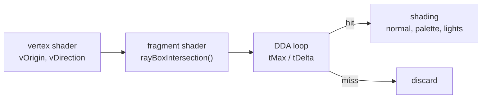
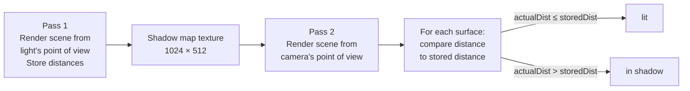
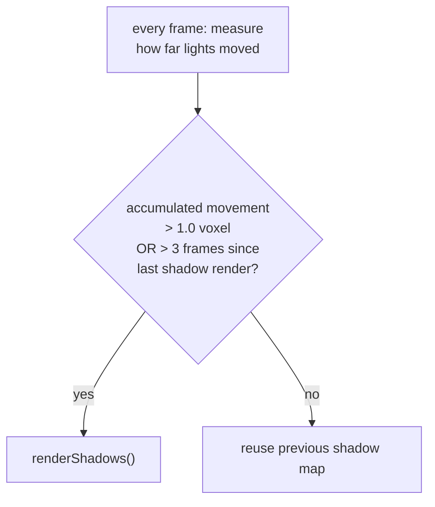
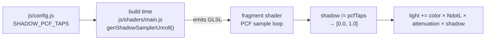
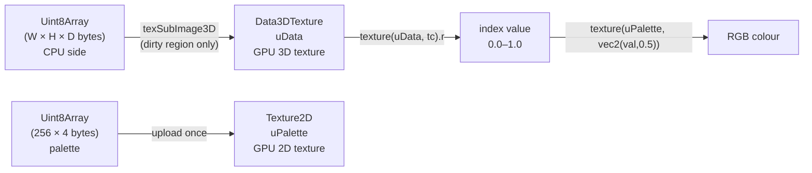
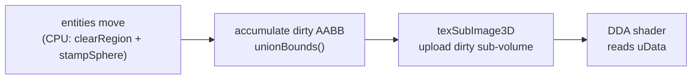

# Architecture Documentation Implementation Plan

> **For agentic workers:** REQUIRED SUB-SKILL: Use superpowers:subagent-driven-development (recommended) or superpowers:executing-plans to implement this plan task-by-task. Steps use checkbox (`- [ ]`) syntax for tracking.

**Goal:** Create a README and five architecture docs teaching voxel DDA raymarching, shadow mapping, PCF, palette textures, and dirty-region GPU uploads to developers unfamiliar with rendering.

**Architecture:** Concept → Theory → Code per document. SVG illustrations in `docs/architecture/img/`. Mermaid for flow diagrams. No ASCII art. All external URLs verified live.

**Tech Stack:** Markdown, SVG, Mermaid, Three.js/WebGL2 (referenced), GLSL (quoted from source)

---

## Verified external URLs

- `https://lodev.org/cgtutor/raycasting.html` ✓
- `https://www.scratchapixel.com/lessons/3d-basic-rendering/minimal-ray-tracer-rendering-simple-shapes/ray-box-intersection.html` ✓
- `https://en.wikipedia.org/wiki/Digital_differential_analyzer_(graphics_algorithm)` ✓
- `https://learnopengl.com/Advanced-Lighting/Shadows/Shadow-Mapping` ✓
- `https://learnopengl.com/Advanced-Lighting/Shadows/Point-Shadows` ✓ (covers PCF)
- `http://www.opengl-tutorial.org/intermediate-tutorials/tutorial-16-shadow-mapping/` ✓
- `https://developer.mozilla.org/en-US/docs/Web/API/WebGL2RenderingContext/texSubImage3D` ✓
- `https://youtu.be/NbSee-XM7WA` ✓ (javidx9 DDA raycasting)

---

## File map

| Action | Path |
|--------|------|
| Create | `docs/architecture/img/dda-2d-grid.svg` |
| Create | `docs/architecture/img/dda-tmax-tdelta.svg` |
| Create | `docs/architecture/img/ray-box-intersection.svg` |
| Create | `docs/architecture/img/shadow-map-overview.svg` |
| Create | `docs/architecture/img/shadow-equirectangular.svg` |
| Create | `docs/architecture/img/pcf-tap-pattern.svg` |
| Create | `docs/architecture/img/palette-lookup.svg` |
| Create | `docs/architecture/img/dirty-region-aabb.svg` |
| Create | `docs/architecture/dda-raymarching.md` |
| Create | `docs/architecture/shadow-mapping.md` |
| Create | `docs/architecture/pcf.md` |
| Create | `docs/architecture/palette-textures.md` |
| Create | `docs/architecture/dirty-region-uploads.md` |
| Create | `README.md` |

---

## SVG style constants (used across all illustrations)

```
background:   #1a1a2e
structure:    #4fc3f7   (cyan)
ray/arrow:    #ff9800   (orange)
hit/shadow:   #f44336   (red)
label text:   #ffffff   (white)
dim text:     #aaaaaa
cell fill:    #0d0d1e
highlight:    rgba(79,195,247,0.18)
viewBox:      0 0 800 420
font-family:  sans-serif
```

---

## Task 1: dda-2d-grid.svg

**Files:**
- Create: `docs/architecture/img/dda-2d-grid.svg`

- [ ] **Step 1: Write the file**

```svg
<svg xmlns="http://www.w3.org/2000/svg" viewBox="0 0 800 420" font-family="sans-serif">
  <rect width="800" height="420" fill="#1a1a2e"/>

  <!-- Title -->
  <text x="400" y="28" fill="#ffffff" font-size="15" text-anchor="middle" font-weight="bold">DDA: stepping through a voxel grid (top-down view)</text>

  <!-- Grid background -->
  <rect x="130" y="55" width="540" height="295" fill="#0d0d1e"/>

  <!-- Traversed cells (6 cols × 5 rows, cell 90×59) -->
  <!-- row y-offsets: r0=55, r1=114, r2=173, r3=232, r4=291  col x-offsets: c0=130,c1=220,c2=310,c3=400,c4=490,c5=580 -->
  <rect x="130" y="291" width="90" height="59" fill="#4fc3f7" opacity="0.18"/>
  <rect x="130" y="232" width="90" height="59" fill="#4fc3f7" opacity="0.18"/>
  <rect x="220" y="232" width="90" height="59" fill="#4fc3f7" opacity="0.18"/>
  <rect x="310" y="173" width="90" height="59" fill="#4fc3f7" opacity="0.18"/>
  <rect x="400" y="173" width="90" height="59" fill="#4fc3f7" opacity="0.18"/>
  <rect x="490" y="114" width="90" height="59" fill="#4fc3f7" opacity="0.18"/>
  <!-- Hit cell -->
  <rect x="580" y="55"  width="90" height="59" fill="#f44336" opacity="0.28"/>

  <!-- Vertical grid lines -->
  <line x1="130" y1="55" x2="130" y2="350" stroke="#4fc3f7" stroke-width="1" opacity="0.55"/>
  <line x1="220" y1="55" x2="220" y2="350" stroke="#4fc3f7" stroke-width="1" opacity="0.55"/>
  <line x1="310" y1="55" x2="310" y2="350" stroke="#4fc3f7" stroke-width="1" opacity="0.55"/>
  <line x1="400" y1="55" x2="400" y2="350" stroke="#4fc3f7" stroke-width="1" opacity="0.55"/>
  <line x1="490" y1="55" x2="490" y2="350" stroke="#4fc3f7" stroke-width="1" opacity="0.55"/>
  <line x1="580" y1="55" x2="580" y2="350" stroke="#4fc3f7" stroke-width="1" opacity="0.55"/>
  <line x1="670" y1="55" x2="670" y2="350" stroke="#4fc3f7" stroke-width="1" opacity="0.55"/>

  <!-- Horizontal grid lines -->
  <line x1="130" y1="55"  x2="670" y2="55"  stroke="#4fc3f7" stroke-width="1" opacity="0.55"/>
  <line x1="130" y1="114" x2="670" y2="114" stroke="#4fc3f7" stroke-width="1" opacity="0.55"/>
  <line x1="130" y1="173" x2="670" y2="173" stroke="#4fc3f7" stroke-width="1" opacity="0.55"/>
  <line x1="130" y1="232" x2="670" y2="232" stroke="#4fc3f7" stroke-width="1" opacity="0.55"/>
  <line x1="130" y1="291" x2="670" y2="291" stroke="#4fc3f7" stroke-width="1" opacity="0.55"/>
  <line x1="130" y1="350" x2="670" y2="350" stroke="#4fc3f7" stroke-width="1" opacity="0.55"/>

  <!-- Volume border -->
  <rect x="130" y="55" width="540" height="295" fill="none" stroke="#4fc3f7" stroke-width="2"/>

  <!-- Ray line -->
  <line x1="50" y1="390" x2="622" y2="77" stroke="#ff9800" stroke-width="2.5"/>
  <!-- Arrowhead -->
  <polygon points="622,77 609,90 619,90" fill="#ff9800"/>

  <!-- Step dots at cell-boundary crossings -->
  <circle cx="130" cy="350" r="4" fill="#4fc3f7"/>
  <circle cx="130" cy="291" r="4" fill="#4fc3f7"/>
  <circle cx="220" cy="261" r="4" fill="#4fc3f7"/>
  <circle cx="310" cy="232" r="4" fill="#4fc3f7"/>
  <circle cx="400" cy="202" r="4" fill="#4fc3f7"/>
  <circle cx="490" cy="173" r="4" fill="#4fc3f7"/>
  <circle cx="580" cy="143" r="4" fill="#4fc3f7"/>
  <circle cx="580" cy="114" r="4" fill="#4fc3f7"/>

  <!-- Step labels in cells -->
  <text x="175" y="326" fill="#4fc3f7" font-size="11" text-anchor="middle">1</text>
  <text x="175" y="267" fill="#4fc3f7" font-size="11" text-anchor="middle">2</text>
  <text x="265" y="267" fill="#4fc3f7" font-size="11" text-anchor="middle">3</text>
  <text x="355" y="208" fill="#4fc3f7" font-size="11" text-anchor="middle">4</text>
  <text x="445" y="208" fill="#4fc3f7" font-size="11" text-anchor="middle">5</text>
  <text x="535" y="149" fill="#4fc3f7" font-size="11" text-anchor="middle">6</text>
  <text x="625" y="90"  fill="#f44336" font-size="12" text-anchor="middle" font-weight="bold">HIT</text>

  <!-- Camera label -->
  <text x="50"  y="408" fill="#ff9800" font-size="12" text-anchor="middle">camera</text>

  <!-- Legend -->
  <rect x="40" y="55" width="14" height="14" fill="#4fc3f7" opacity="0.18"/>
  <text x="60" y="66" fill="#aaaaaa" font-size="11">traversed cell</text>
  <rect x="40" y="76" width="14" height="14" fill="#f44336" opacity="0.28"/>
  <text x="60" y="87" fill="#aaaaaa" font-size="11">first filled voxel</text>
</svg>
```

- [ ] **Step 2: Verify it renders**

Open `docs/architecture/img/dda-2d-grid.svg` directly in a browser. You should see a dark background, a 6×5 cyan grid, a diagonal orange ray stepping through 7 highlighted cells, and a red "HIT" cell in the top-right.

- [ ] **Step 3: Commit**

```bash
git add docs/architecture/img/dda-2d-grid.svg
git commit -m "docs: add DDA 2D grid SVG illustration"
```

---

## Task 2: dda-tmax-tdelta.svg

**Files:**
- Create: `docs/architecture/img/dda-tmax-tdelta.svg`

- [ ] **Step 1: Write the file**

```svg
<svg xmlns="http://www.w3.org/2000/svg" viewBox="0 0 800 420" font-family="sans-serif">
  <rect width="800" height="420" fill="#1a1a2e"/>

  <text x="400" y="28" fill="#ffffff" font-size="15" text-anchor="middle" font-weight="bold">tMax and tDelta: how DDA measures distance to the next grid boundary</text>

  <!-- Grid lines (vertical, x-boundaries at 160, 280, 400, 520, 640) -->
  <line x1="160" y1="60" x2="160" y2="340" stroke="#4fc3f7" stroke-width="1" opacity="0.5" stroke-dasharray="4,3"/>
  <line x1="280" y1="60" x2="280" y2="340" stroke="#4fc3f7" stroke-width="1" opacity="0.5" stroke-dasharray="4,3"/>
  <line x1="400" y1="60" x2="400" y2="340" stroke="#4fc3f7" stroke-width="1" opacity="0.5" stroke-dasharray="4,3"/>
  <line x1="520" y1="60" x2="520" y2="340" stroke="#4fc3f7" stroke-width="1" opacity="0.5" stroke-dasharray="4,3"/>
  <line x1="640" y1="60" x2="640" y2="340" stroke="#4fc3f7" stroke-width="1" opacity="0.5" stroke-dasharray="4,3"/>

  <!-- Grid lines (horizontal, y-boundaries at 140, 240) -->
  <line x1="80" y1="140" x2="720" y2="140" stroke="#4fc3f7" stroke-width="1" opacity="0.5" stroke-dasharray="4,3"/>
  <line x1="80" y1="240" x2="720" y2="240" stroke="#4fc3f7" stroke-width="1" opacity="0.5" stroke-dasharray="4,3"/>

  <!-- X-axis labels -->
  <text x="160" y="356" fill="#4fc3f7" font-size="11" text-anchor="middle" opacity="0.7">x=1</text>
  <text x="280" y="356" fill="#4fc3f7" font-size="11" text-anchor="middle" opacity="0.7">x=2</text>
  <text x="400" y="356" fill="#4fc3f7" font-size="11" text-anchor="middle" opacity="0.7">x=3</text>
  <text x="520" y="356" fill="#4fc3f7" font-size="11" text-anchor="middle" opacity="0.7">x=4</text>

  <!-- Ray (from bottom-left to upper-right) -->
  <line x1="80" y1="320" x2="700" y2="80" stroke="#ff9800" stroke-width="2.5"/>
  <polygon points="700,80 686,90 693,76" fill="#ff9800"/>

  <!-- Current position on ray (between x=1 and x=2 boundaries) -->
  <circle cx="196" cy="258" r="6" fill="#ff9800"/>
  <text x="196" y="278" fill="#ff9800" font-size="11" text-anchor="middle">current pos</text>

  <!-- tMax.x: horizontal distance from current pos to next x-boundary (x=2, at pixel x=280) -->
  <line x1="196" y1="295" x2="280" y2="295" stroke="#4fc3f7" stroke-width="1.5" marker-end="url(#arr-cyan)" marker-start="url(#arr-cyan-rev)"/>
  <text x="238" y="314" fill="#4fc3f7" font-size="12" text-anchor="middle">tMax.x</text>

  <!-- tDelta.x: full cell width (x=2 to x=3, at pixel 280 to 400) -->
  <line x1="280" y1="370" x2="400" y2="370" stroke="#ffffff" stroke-width="1.5"/>
  <line x1="280" y1="363" x2="280" y2="377" stroke="#ffffff" stroke-width="1.5"/>
  <line x1="400" y1="363" x2="400" y2="377" stroke="#ffffff" stroke-width="1.5"/>
  <text x="340" y="390" fill="#ffffff" font-size="12" text-anchor="middle">tDelta.x (one full cell)</text>

  <!-- tMax.y: vertical distance from current pos to next y-boundary (y=1, at pixel y=140) -->
  <line x1="100" y1="258" x2="100" y2="140" stroke="#f44336" stroke-width="1.5"/>
  <line x1="93" y1="258" x2="107" y2="258" stroke="#f44336" stroke-width="1.5"/>
  <line x1="93" y1="140" x2="107" y2="140" stroke="#f44336" stroke-width="1.5"/>
  <text x="60" y="200" fill="#f44336" font-size="12" text-anchor="middle">tMax.y</text>

  <!-- tDelta.y: full cell height (y=1 to y=2, pixels 140 to 240) -->
  <line x1="730" y1="140" x2="730" y2="240" stroke="#aaaaaa" stroke-width="1.5"/>
  <line x1="723" y1="140" x2="737" y2="140" stroke="#aaaaaa" stroke-width="1.5"/>
  <line x1="723" y1="240" x2="737" y2="240" stroke="#aaaaaa" stroke-width="1.5"/>
  <text x="762" y="195" fill="#aaaaaa" font-size="12" text-anchor="middle">tDelta.y</text>

  <!-- Explanation box -->
  <rect x="440" y="255" width="260" height="70" rx="6" fill="#0d0d1e" stroke="#4fc3f7" stroke-width="1" opacity="0.8"/>
  <text x="570" y="277" fill="#ffffff" font-size="12" text-anchor="middle">Each step: pick the axis</text>
  <text x="570" y="295" fill="#ffffff" font-size="12" text-anchor="middle">with the smallest tMax.</text>
  <text x="570" y="313" fill="#4fc3f7" font-size="12" text-anchor="middle">Advance that axis → add tDelta.</text>
</svg>
```

- [ ] **Step 2: Verify it renders**

Open in browser. You should see a diagonal orange ray crossing dashed cyan vertical (x) and horizontal (y) grid lines, with labelled tMax.x, tMax.y, tDelta.x, tDelta.y distances and an explanation box.

- [ ] **Step 3: Commit**

```bash
git add docs/architecture/img/dda-tmax-tdelta.svg
git commit -m "docs: add tMax/tDelta DDA diagram SVG"
```

---

## Task 3: ray-box-intersection.svg

**Files:**
- Create: `docs/architecture/img/ray-box-intersection.svg`

- [ ] **Step 1: Write the file**

```svg
<svg xmlns="http://www.w3.org/2000/svg" viewBox="0 0 800 420" font-family="sans-serif">
  <rect width="800" height="420" fill="#1a1a2e"/>

  <text x="400" y="28" fill="#ffffff" font-size="15" text-anchor="middle" font-weight="bold">Ray–box intersection: finding where the ray enters and exits the voxel volume</text>

  <!-- Voxel volume box -->
  <rect x="250" y="100" width="320" height="230" rx="4" fill="#0d0d1e" stroke="#4fc3f7" stroke-width="2"/>
  <text x="410" y="220" fill="#4fc3f7" font-size="14" text-anchor="middle" opacity="0.6">voxel volume</text>
  <text x="410" y="238" fill="#4fc3f7" font-size="12" text-anchor="middle" opacity="0.4">(W × H × D)</text>

  <!-- Ray line: from left outside to right outside, passing through box -->
  <!-- Entry at ~x=250,y=230; exit at ~x=570,y=180 -->
  <line x1="60" y1="265" x2="730" y2="155" stroke="#ff9800" stroke-width="2.5"/>

  <!-- Entry point dot (tN) -->
  <!-- where x=250: t proportional. full line is (60,265)→(730,155). dx=670, dy=-110. at x=250: t=(250-60)/670=0.284. y=265-110*0.284=234 -->
  <circle cx="250" cy="234" r="7" fill="#4fc3f7" stroke="#1a1a2e" stroke-width="2"/>
  <text x="232" y="260" fill="#4fc3f7" font-size="13" text-anchor="middle" font-weight="bold">tN</text>
  <text x="232" y="276" fill="#aaaaaa" font-size="11" text-anchor="middle">(entry)</text>

  <!-- Exit point dot (tF) -->
  <!-- where x=570: t=(570-60)/670=0.761. y=265-110*0.761=181 -->
  <circle cx="570" cy="181" r="7" fill="#f44336" stroke="#1a1a2e" stroke-width="2"/>
  <text x="588" y="175" fill="#f44336" font-size="13" font-weight="bold">tF</text>
  <text x="588" y="191" fill="#aaaaaa" font-size="11">(exit)</text>

  <!-- Camera / origin label -->
  <circle cx="60" cy="265" r="5" fill="#ff9800"/>
  <text x="60" y="285" fill="#ff9800" font-size="12" text-anchor="middle">origin</text>

  <!-- Arrow tip -->
  <polygon points="730,155 714,157 720,168" fill="#ff9800"/>

  <!-- Region labels along ray -->
  <text x="155" y="264" fill="#aaaaaa" font-size="11" text-anchor="middle">outside</text>
  <text x="410" y="155" fill="#ffffff" font-size="11" text-anchor="middle">DDA marches here</text>
  <!-- arrow from label to ray segment inside box -->
  <line x1="410" y1="161" x2="410" y2="207" stroke="#aaaaaa" stroke-width="1" stroke-dasharray="3,2"/>
  <text x="650" y="163" fill="#aaaaaa" font-size="11" text-anchor="middle">outside</text>

  <!-- Formula box -->
  <rect x="30" y="340" width="740" height="62" rx="6" fill="#0d0d1e" stroke="#4fc3f7" stroke-width="1"/>
  <text x="400" y="362" fill="#aaaaaa" font-size="12" text-anchor="middle">For each axis: compute where the ray hits the slab (min and max plane). </text>
  <text x="400" y="380" fill="#4fc3f7" font-size="12" text-anchor="middle">tN = max(tmin.x, tmin.y, tmin.z)   |   tF = min(tmax.x, tmax.y, tmax.z)   |   hit if tN ≤ tF</text>
  <text x="400" y="396" fill="#aaaaaa" font-size="12" text-anchor="middle">Start DDA at t = max(tN, 0) — the entry point (or camera if inside the box)</text>
</svg>
```

- [ ] **Step 2: Verify it renders**

Open in browser. Should show a box labelled "voxel volume", a diagonal orange ray passing through it, cyan tN entry dot and red tF exit dot, with a formula summary at the bottom.

- [ ] **Step 3: Commit**

```bash
git add docs/architecture/img/ray-box-intersection.svg
git commit -m "docs: add ray-box intersection SVG"
```

---

## Task 4: shadow-map-overview.svg

**Files:**
- Create: `docs/architecture/img/shadow-map-overview.svg`

- [ ] **Step 1: Write the file**

```svg
<svg xmlns="http://www.w3.org/2000/svg" viewBox="0 0 800 420" font-family="sans-serif">
  <rect width="800" height="420" fill="#1a1a2e"/>

  <text x="400" y="28" fill="#ffffff" font-size="15" text-anchor="middle" font-weight="bold">Shadow mapping: render from the light, store distances, compare at shade time</text>

  <!-- ===== LEFT PANEL: scene from light's perspective ===== -->
  <text x="190" y="58" fill="#aaaaaa" font-size="12" text-anchor="middle">Step 1: render from light</text>

  <!-- Light source -->
  <circle cx="80" cy="100" r="14" fill="#ff9800" opacity="0.9"/>
  <text x="80" y="130" fill="#ff9800" font-size="11" text-anchor="middle">light</text>

  <!-- Occluder voxel -->
  <rect x="170" y="160" width="50" height="50" rx="3" fill="#4fc3f7" opacity="0.7"/>
  <text x="195" y="228" fill="#4fc3f7" font-size="11" text-anchor="middle">occluder</text>

  <!-- Surface voxel (in shadow) -->
  <rect x="270" y="250" width="50" height="50" rx="3" fill="#555577"/>
  <text x="295" y="320" fill="#aaaaaa" font-size="11" text-anchor="middle">surface</text>

  <!-- Ray from light to occluder (hits, blocked) -->
  <line x1="92" y1="110" x2="175" y2="168" stroke="#ff9800" stroke-width="2"/>
  <circle cx="175" cy="168" r="4" fill="#f44336"/>
  <text x="125" y="148" fill="#f44336" font-size="10">blocked</text>

  <!-- Ray from light past occluder (misses occluder, reaches surface — shadow!) -->
  <line x1="92" y1="112" x2="272" y2="258" stroke="#ff9800" stroke-width="1.5" stroke-dasharray="5,3" opacity="0.5"/>
  <!-- shadow cast on surface -->
  <rect x="270" y="250" width="50" height="50" rx="3" fill="#000000" opacity="0.5"/>

  <!-- Stored distance label -->
  <text x="140" y="355" fill="#4fc3f7" font-size="11" text-anchor="middle">stored distance = 95 voxels</text>

  <!-- Panel separator -->
  <line x1="390" y1="45" x2="390" y2="395" stroke="#333355" stroke-width="1.5"/>

  <!-- ===== ARROW between panels ===== -->
  <text x="390" y="215" fill="#aaaaaa" font-size="20" text-anchor="middle">→</text>

  <!-- ===== RIGHT PANEL: shadow map + comparison ===== -->
  <text x="600" y="58" fill="#aaaaaa" font-size="12" text-anchor="middle">Step 2: compare at shade time</text>

  <!-- Shadow map texture (flat 2D rect) -->
  <rect x="430" y="75" width="330" height="165" rx="3" fill="#0d0d1e" stroke="#4fc3f7" stroke-width="1.5"/>
  <!-- bright region (unblocked directions) -->
  <rect x="432" y="77" width="150" height="161" rx="2" fill="#333355"/>
  <!-- dark region (blocked by occluder) -->
  <rect x="582" y="77" width="55"  height="80"  fill="#111122"/>
  <text x="595" y="245" fill="#aaaaaa" font-size="10" text-anchor="middle">shadow map (1024×512)</text>

  <!-- Comparison formula -->
  <rect x="430" y="265" width="330" height="100" rx="6" fill="#0d0d1e" stroke="#4fc3f7" stroke-width="1"/>
  <text x="595" y="289" fill="#aaaaaa" font-size="12" text-anchor="middle">At shade time:</text>
  <text x="595" y="309" fill="#ffffff" font-size="12" text-anchor="middle">actualDist = dist(surface, light)</text>
  <text x="595" y="329" fill="#ffffff" font-size="12" text-anchor="middle">storedDist = shadowMap.sample(dir)</text>
  <text x="595" y="352" fill="#4fc3f7" font-size="12" text-anchor="middle" font-weight="bold">inShadow = actualDist &gt; storedDist + bias</text>
</svg>
```

- [ ] **Step 2: Verify it renders**

Open in browser. Left: light, occluder, shadowed surface with blocked ray. Right: shadow map texture rectangle + comparison formula.

- [ ] **Step 3: Commit**

```bash
git add docs/architecture/img/shadow-map-overview.svg
git commit -m "docs: add shadow map overview SVG"
```

---

## Task 5: shadow-equirectangular.svg

**Files:**
- Create: `docs/architecture/img/shadow-equirectangular.svg`

- [ ] **Step 1: Write the file**

```svg
<svg xmlns="http://www.w3.org/2000/svg" viewBox="0 0 800 420" font-family="sans-serif">
  <rect width="800" height="420" fill="#1a1a2e"/>

  <text x="400" y="28" fill="#ffffff" font-size="15" text-anchor="middle" font-weight="bold">Equirectangular projection: storing all directions from a point light in one texture</text>

  <!-- ===== LEFT: sphere of directions ===== -->
  <!-- Sphere outline -->
  <circle cx="200" cy="220" r="130" fill="#0d0d1e" stroke="#4fc3f7" stroke-width="1.5"/>

  <!-- Latitude lines (horizontal) -->
  <ellipse cx="200" cy="155" rx="100" ry="20" fill="none" stroke="#4fc3f7" stroke-width="0.8" opacity="0.4"/>
  <ellipse cx="200" cy="220" rx="130" ry="26" fill="none" stroke="#4fc3f7" stroke-width="0.8" opacity="0.4"/>
  <ellipse cx="200" cy="285" rx="100" ry="20" fill="none" stroke="#4fc3f7" stroke-width="0.8" opacity="0.4"/>

  <!-- Longitude lines (vertical arcs, approximated as ellipses) -->
  <ellipse cx="200" cy="220" rx="20" ry="130" fill="none" stroke="#4fc3f7" stroke-width="0.8" opacity="0.4"/>
  <ellipse cx="200" cy="220" rx="60" ry="130" fill="none" stroke="#4fc3f7" stroke-width="0.8" opacity="0.4"/>
  <ellipse cx="200" cy="220" rx="100" ry="130" fill="none" stroke="#4fc3f7" stroke-width="0.8" opacity="0.4"/>

  <!-- Light source in centre -->
  <circle cx="200" cy="220" r="8" fill="#ff9800"/>
  <text x="200" y="244" fill="#ff9800" font-size="11" text-anchor="middle">light</text>

  <!-- A sample direction ray -->
  <line x1="200" y1="220" x2="286" y2="130" stroke="#ff9800" stroke-width="1.5" opacity="0.8"/>
  <circle cx="286" cy="130" r="4" fill="#ff9800"/>

  <text x="200" y="390" fill="#aaaaaa" font-size="12" text-anchor="middle">sphere of all directions</text>
  <text x="200" y="406" fill="#aaaaaa" font-size="11" text-anchor="middle">(every ray from the light)</text>

  <!-- Arrow -->
  <text x="400" y="226" fill="#aaaaaa" font-size="28" text-anchor="middle">→</text>
  <text x="400" y="252" fill="#aaaaaa" font-size="10" text-anchor="middle">unroll</text>

  <!-- ===== RIGHT: flat 2D texture ===== -->
  <rect x="460" y="120" width="290" height="145" rx="3" fill="#0d0d1e" stroke="#4fc3f7" stroke-width="1.5"/>

  <!-- Latitude grid lines in texture -->
  <line x1="460" y1="168" x2="750" y2="168" stroke="#4fc3f7" stroke-width="0.7" opacity="0.4"/>
  <line x1="460" y1="216" stroke="#4fc3f7" x2="750" y2="216" stroke-width="0.7" opacity="0.4"/>

  <!-- Longitude grid lines in texture -->
  <line x1="532" y1="120" x2="532" y2="265" stroke="#4fc3f7" stroke-width="0.7" opacity="0.4"/>
  <line x1="605" y1="120" x2="605" y2="265" stroke="#4fc3f7" stroke-width="0.7" opacity="0.4"/>
  <line x1="677" y1="120" x2="677" y2="265" stroke="#4fc3f7" stroke-width="0.7" opacity="0.4"/>

  <!-- UV axis labels -->
  <text x="605" y="113" fill="#aaaaaa" font-size="11" text-anchor="middle">φ (longitude) →</text>
  <text x="448" y="195" fill="#aaaaaa" font-size="11" text-anchor="end">θ</text>

  <!-- The same sample direction mapped to UV -->
  <circle cx="664" cy="145" r="4" fill="#ff9800"/>
  <text x="664" y="136" fill="#ff9800" font-size="10" text-anchor="middle">same dir</text>

  <text x="605" y="288" fill="#aaaaaa" font-size="12" text-anchor="middle">1024 × 512 shadow map texture</text>
  <text x="605" y="304" fill="#aaaaaa" font-size="11" text-anchor="middle">each pixel = distance to nearest voxel in that direction</text>

  <!-- Formula -->
  <rect x="460" y="320" width="290" height="60" rx="5" fill="#0d0d1e" stroke="#4fc3f7" stroke-width="1"/>
  <text x="605" y="342" fill="#aaaaaa" font-size="11" text-anchor="middle">φ = atan(dir.x, dir.z)  →  U = φ/2π + 0.5</text>
  <text x="605" y="360" fill="#aaaaaa" font-size="11" text-anchor="middle">θ = asin(dir.y)         →  V = θ/π  + 0.5</text>
  <text x="605" y="374" fill="#4fc3f7" font-size="10" text-anchor="middle">js/shaders/main.js: dirToEquirectUV()</text>
</svg>
```

- [ ] **Step 2: Verify it renders**

Open in browser. Left: a sphere with latitude/longitude lines and a central light. Right: the same sphere "unrolled" into a flat 2D texture rectangle, with projection formula.

- [ ] **Step 3: Commit**

```bash
git add docs/architecture/img/shadow-equirectangular.svg
git commit -m "docs: add equirectangular projection SVG"
```

---

## Task 6: pcf-tap-pattern.svg

**Files:**
- Create: `docs/architecture/img/pcf-tap-pattern.svg`

- [ ] **Step 1: Write the file**

```svg
<svg xmlns="http://www.w3.org/2000/svg" viewBox="0 0 800 420" font-family="sans-serif">
  <rect width="800" height="420" fill="#1a1a2e"/>

  <text x="400" y="28" fill="#ffffff" font-size="15" text-anchor="middle" font-weight="bold">PCF: averaging multiple shadow map samples to soften shadow edges</text>

  <!-- ===== LEFT: 1 tap ===== -->
  <text x="200" y="58" fill="#aaaaaa" font-size="13" text-anchor="middle">1 tap — hard edge</text>

  <!-- Simulated shadow edge (sharp): left half in shadow -->
  <rect x="40"  y="75" width="160" height="200" fill="#111122"/>
  <rect x="200" y="75" width="160" height="200" fill="#334466"/>
  <!-- Jagged edge pixels -->
  <rect x="196" y="75"  width="8" height="25" fill="#111122"/>
  <rect x="196" y="120" width="8" height="25" fill="#111122"/>
  <rect x="196" y="165" width="8" height="25" fill="#334466"/>
  <rect x="196" y="210" width="8" height="25" fill="#111122"/>
  <rect x="196" y="255" width="8" height="20" fill="#334466"/>
  <rect x="200" y="95"  width="8" height="25" fill="#334466"/>
  <rect x="200" y="140" width="8" height="25" fill="#334466"/>
  <rect x="200" y="185" width="8" height="25" fill="#111122"/>
  <rect x="200" y="230" width="8" height="25" fill="#334466"/>

  <!-- Border -->
  <rect x="40" y="75" width="320" height="200" fill="none" stroke="#4fc3f7" stroke-width="1" opacity="0.5"/>

  <!-- Single sample point -->
  <circle cx="200" cy="175" r="7" fill="#ff9800" stroke="#ffffff" stroke-width="1.5"/>
  <text x="200" y="302" fill="#ff9800" font-size="11" text-anchor="middle">1 sample</text>
  <text x="200" y="318" fill="#aaaaaa" font-size="11" text-anchor="middle">result: 0 or 1 (binary)</text>

  <!-- ===== Panel separator ===== -->
  <line x1="400" y1="50" x2="400" y2="380" stroke="#333355" stroke-width="1.5"/>

  <!-- ===== RIGHT: 5-tap PCF ===== -->
  <text x="600" y="58" fill="#aaaaaa" font-size="13" text-anchor="middle">5 taps (PCF) — soft edge</text>

  <!-- Simulated shadow edge (soft gradient) -->
  <rect x="440" y="75" width="160" height="200" fill="#111122"/>
  <rect x="600" y="75" width="160" height="200" fill="#334466"/>
  <!-- Gradient transition strip -->
  <rect x="586" y="75" width="28" height="200" fill="url(#grad-soft)"/>
  <defs>
    <linearGradient id="grad-soft" x1="0" y1="0" x2="1" y2="0">
      <stop offset="0%"   stop-color="#111122"/>
      <stop offset="100%" stop-color="#334466"/>
    </linearGradient>
  </defs>

  <!-- Border -->
  <rect x="440" y="75" width="320" height="200" fill="none" stroke="#4fc3f7" stroke-width="1" opacity="0.5"/>

  <!-- 5-tap cross pattern -->
  <!-- center -->
  <circle cx="600" cy="175" r="6" fill="#ff9800" stroke="#ffffff" stroke-width="1.5"/>
  <!-- right -->
  <circle cx="622" cy="175" r="6" fill="#ff9800" stroke="#ffffff" stroke-width="1.5"/>
  <!-- left -->
  <circle cx="578" cy="175" r="6" fill="#ff9800" stroke="#ffffff" stroke-width="1.5"/>
  <!-- up -->
  <circle cx="600" cy="153" r="6" fill="#ff9800" stroke="#ffffff" stroke-width="1.5"/>
  <!-- down -->
  <circle cx="600" cy="197" r="6" fill="#ff9800" stroke="#ffffff" stroke-width="1.5"/>

  <!-- Cross lines connecting taps -->
  <line x1="578" y1="175" x2="622" y2="175" stroke="#ff9800" stroke-width="1" stroke-dasharray="3,2" opacity="0.6"/>
  <line x1="600" y1="153" x2="600" y2="197" stroke="#ff9800" stroke-width="1" stroke-dasharray="3,2" opacity="0.6"/>

  <text x="600" y="302" fill="#ff9800" font-size="11" text-anchor="middle">5 samples (cross pattern)</text>
  <text x="600" y="318" fill="#aaaaaa" font-size="11" text-anchor="middle">result: 0.0 – 1.0 (averaged)</text>

  <!-- Offset label -->
  <text x="635" y="163" fill="#aaaaaa" font-size="10">+ts.x</text>
  <text x="544" y="163" fill="#aaaaaa" font-size="10">-ts.x</text>
  <text x="608" y="148" fill="#aaaaaa" font-size="10">-ts.y</text>
  <text x="608" y="212" fill="#aaaaaa" font-size="10">+ts.y</text>

  <!-- Formula -->
  <rect x="40" y="340" width="720" height="60" rx="6" fill="#0d0d1e" stroke="#4fc3f7" stroke-width="1"/>
  <text x="400" y="363" fill="#aaaaaa" font-size="12" text-anchor="middle">ts = vec2(1/256, 1/128)  — one texel in shadow map UV space</text>
  <text x="400" y="383" fill="#4fc3f7" font-size="12" text-anchor="middle">shadow = (s0 + s1 + s2 + s3 + s4) / 5.0     js/shaders/main.js: genShadowSamplerUnroll()</text>
</svg>
```

- [ ] **Step 2: Verify it renders**

Open in browser. Left panel: sharp shadow edge with a single sample dot. Right panel: same edge but softened, with the 5-tap cross pattern of orange dots.

- [ ] **Step 3: Commit**

```bash
git add docs/architecture/img/pcf-tap-pattern.svg
git commit -m "docs: add PCF tap pattern SVG"
```

---

## Task 7: palette-lookup.svg

**Files:**
- Create: `docs/architecture/img/palette-lookup.svg`

- [ ] **Step 1: Write the file**

```svg
<svg xmlns="http://www.w3.org/2000/svg" viewBox="0 0 800 420" font-family="sans-serif">
  <rect width="800" height="420" fill="#1a1a2e"/>

  <text x="400" y="28" fill="#ffffff" font-size="15" text-anchor="middle" font-weight="bold">Palette textures: 1 byte per voxel indexes into a 256-entry colour table</text>

  <!-- ===== LEFT: voxel data grid (4×4, shown as flat slice) ===== -->
  <text x="130" y="60" fill="#aaaaaa" font-size="12" text-anchor="middle">voxel data (1 byte each)</text>

  <!-- Grid cells with index values -->
  <!-- Row 0 -->
  <rect x="40"  y="72" width="60" height="60" fill="#0d0d1e" stroke="#4fc3f7" stroke-width="1"/>
  <text x="70"  y="107" fill="#aaaaaa" font-size="16" text-anchor="middle">0</text>

  <rect x="100" y="72" width="60" height="60" fill="#0d0d1e" stroke="#4fc3f7" stroke-width="1"/>
  <text x="130" y="107" fill="#ffffff" font-size="16" text-anchor="middle">3</text>

  <rect x="160" y="72" width="60" height="60" fill="#0d0d1e" stroke="#4fc3f7" stroke-width="1"/>
  <text x="190" y="107" fill="#aaaaaa" font-size="16" text-anchor="middle">0</text>

  <rect x="220" y="72" width="60" height="60" fill="#0d0d1e" stroke="#4fc3f7" stroke-width="1"/>
  <text x="250" y="107" fill="#aaaaaa" font-size="16" text-anchor="middle">0</text>

  <!-- Row 1 -->
  <rect x="40"  y="132" width="60" height="60" fill="#0d0d1e" stroke="#4fc3f7" stroke-width="1"/>
  <text x="70"  y="167" fill="#ffffff" font-size="16" text-anchor="middle">1</text>

  <rect x="100" y="132" width="60" height="60" fill="#0d0d1e" stroke="#4fc3f7" stroke-width="1"/>
  <text x="130" y="167" fill="#aaaaaa" font-size="16" text-anchor="middle">0</text>

  <rect x="160" y="132" width="60" height="60" fill="#0d0d1e" stroke="#4fc3f7" stroke-width="1"/>
  <text x="190" y="167" fill="#ffffff" font-size="16" text-anchor="middle">2</text>

  <rect x="220" y="132" width="60" height="60" fill="#0d0d1e" stroke="#4fc3f7" stroke-width="1"/>
  <text x="250" y="167" fill="#aaaaaa" font-size="16" text-anchor="middle">0</text>

  <!-- Row 2 -->
  <rect x="40"  y="192" width="60" height="60" fill="#0d0d1e" stroke="#4fc3f7" stroke-width="1"/>
  <text x="70"  y="227" fill="#aaaaaa" font-size="16" text-anchor="middle">0</text>

  <rect x="100" y="192" width="60" height="60" fill="#0d0d1e" stroke="#4fc3f7" stroke-width="1"/>
  <text x="130" y="227" fill="#ffffff" font-size="16" text-anchor="middle">2</text>

  <rect x="160" y="192" width="60" height="60" fill="#0d0d1e" stroke="#4fc3f7" stroke-width="1"/>
  <text x="190" y="227" fill="#aaaaaa" font-size="16" text-anchor="middle">0</text>

  <rect x="220" y="192" width="60" height="60" fill="#0d0d1e" stroke="#4fc3f7" stroke-width="1"/>
  <text x="250" y="227" fill="#ffffff" font-size="16" text-anchor="middle">3</text>

  <text x="145" y="275" fill="#4fc3f7" font-size="11" text-anchor="middle">0 = empty, 1–254 = entity, 255 = wall</text>

  <!-- ===== ARROW ===== -->
  <text x="340" y="180" fill="#aaaaaa" font-size="28" text-anchor="middle">→</text>
  <text x="340" y="204" fill="#aaaaaa" font-size="10" text-anchor="middle">lookup</text>

  <!-- ===== MIDDLE: palette table ===== -->
  <text x="470" y="60" fill="#aaaaaa" font-size="12" text-anchor="middle">palette (256 entries)</text>

  <!-- Entry 0: empty -->
  <rect x="390" y="72" width="160" height="36" fill="#0d0d1e" stroke="#333355" stroke-width="1"/>
  <text x="408" y="95" fill="#555577" font-size="12">0</text>
  <text x="480" y="95" fill="#555577" font-size="12" text-anchor="middle">empty</text>

  <!-- Entry 1: blue -->
  <rect x="390" y="108" width="160" height="36" fill="#1565c0" opacity="0.7" stroke="#333355" stroke-width="1"/>
  <text x="408" y="131" fill="#ffffff" font-size="12">1</text>
  <text x="480" y="131" fill="#ffffff" font-size="12" text-anchor="middle">rgb(0.12, 0.35, 0.74)</text>

  <!-- Entry 2: green -->
  <rect x="390" y="144" width="160" height="36" fill="#2e7d32" opacity="0.7" stroke="#333355" stroke-width="1"/>
  <text x="408" y="167" fill="#ffffff" font-size="12">2</text>
  <text x="480" y="167" fill="#ffffff" font-size="12" text-anchor="middle">rgb(0.10, 0.42, 0.13)</text>

  <!-- Entry 3: orange-red -->
  <rect x="390" y="180" width="160" height="36" fill="#c62828" opacity="0.7" stroke="#333355" stroke-width="1"/>
  <text x="408" y="203" fill="#ffffff" font-size="12">3</text>
  <text x="480" y="203" fill="#ffffff" font-size="12" text-anchor="middle">rgb(0.72, 0.10, 0.10)</text>

  <!-- Ellipsis -->
  <text x="470" y="240" fill="#aaaaaa" font-size="14" text-anchor="middle">⋮</text>
  <text x="470" y="260" fill="#aaaaaa" font-size="11" text-anchor="middle">(252 more entries)</text>

  <!-- Entry 255: wall -->
  <rect x="390" y="270" width="160" height="36" fill="#6d4c41" opacity="0.8" stroke="#333355" stroke-width="1"/>
  <text x="408" y="293" fill="#ffffff" font-size="12">255</text>
  <text x="480" y="293" fill="#ffffff" font-size="12" text-anchor="middle">wall (concrete)</text>

  <!-- ===== ARROW 2 ===== -->
  <text x="590" y="180" fill="#aaaaaa" font-size="28" text-anchor="middle">→</text>

  <!-- ===== RIGHT: rendered colours ===== -->
  <text x="710" y="60" fill="#aaaaaa" font-size="12" text-anchor="middle">rendered colour</text>

  <!-- Coloured voxel grid matching left side -->
  <!-- Row 0 -->
  <rect x="640" y="72"  width="60" height="60" fill="#0d0d1e" stroke="#4fc3f7" stroke-width="1" opacity="0.3"/>
  <rect x="700" y="72"  width="60" height="60" fill="#c62828" stroke="#4fc3f7" stroke-width="1"/>
  <rect x="760" y="72"  width="0"  height="60"/>
  <!-- Row 1 -->
  <rect x="640" y="132" width="60" height="60" fill="#1565c0" stroke="#4fc3f7" stroke-width="1"/>
  <rect x="700" y="132" width="60" height="60" fill="#0d0d1e" stroke="#4fc3f7" stroke-width="1" opacity="0.3"/>
  <!-- Row 2 (partial) -->
  <rect x="640" y="192" width="60" height="60" fill="#0d0d1e" stroke="#4fc3f7" stroke-width="1" opacity="0.3"/>
  <rect x="700" y="192" width="60" height="60" fill="#2e7d32" stroke="#4fc3f7" stroke-width="1"/>

  <!-- Note on savings -->
  <rect x="40" y="330" width="720" height="60" rx="6" fill="#0d0d1e" stroke="#4fc3f7" stroke-width="1"/>
  <text x="400" y="354" fill="#aaaaaa" font-size="12" text-anchor="middle">320 × 200 × 200 voxels × 1 byte = 12.8 MB   vs   × 3 bytes RGB = 38.4 MB</text>
  <text x="400" y="376" fill="#4fc3f7" font-size="12" text-anchor="middle">js/textures.js: createDataTexture() (RED, UNSIGNED_BYTE)  +  createPaletteTexture()</text>
</svg>
```

- [ ] **Step 2: Verify it renders**

Open in browser. Left: 4×4 grid of index numbers (0–3). Middle: palette entries for indices 0–3 with colours. Right: grid redrawn in those colours.

- [ ] **Step 3: Commit**

```bash
git add docs/architecture/img/palette-lookup.svg
git commit -m "docs: add palette texture lookup SVG"
```

---

## Task 8: dirty-region-aabb.svg

**Files:**
- Create: `docs/architecture/img/dirty-region-aabb.svg`

- [ ] **Step 1: Write the file**

```svg
<svg xmlns="http://www.w3.org/2000/svg" viewBox="0 0 800 420" font-family="sans-serif">
  <rect width="800" height="420" fill="#1a1a2e"/>

  <text x="400" y="28" fill="#ffffff" font-size="15" text-anchor="middle" font-weight="bold">Dirty-region upload: only send the changed sub-volume to the GPU each frame</text>

  <!-- Full grid (large rectangle) -->
  <rect x="60" y="65" width="680" height="310" rx="4" fill="#0d0d1e" stroke="#4fc3f7" stroke-width="1.5" opacity="0.6"/>
  <text x="400" y="95" fill="#4fc3f7" font-size="13" text-anchor="middle" opacity="0.5">full voxel grid  W × H × D</text>
  <text x="400" y="113" fill="#4fc3f7" font-size="11" text-anchor="middle" opacity="0.4">(e.g. 320 × 200 × 200 = 12.8 MB)</text>

  <!-- Faint grid lines suggesting individual voxels -->
  <line x1="60"  y1="130" x2="740" y2="130" stroke="#4fc3f7" stroke-width="0.4" opacity="0.2"/>
  <line x1="60"  y1="200" x2="740" y2="200" stroke="#4fc3f7" stroke-width="0.4" opacity="0.2"/>
  <line x1="60"  y1="270" x2="740" y2="270" stroke="#4fc3f7" stroke-width="0.4" opacity="0.2"/>
  <line x1="200" y1="65"  x2="200" y2="375" stroke="#4fc3f7" stroke-width="0.4" opacity="0.2"/>
  <line x1="400" y1="65"  x2="400" y2="375" stroke="#4fc3f7" stroke-width="0.4" opacity="0.2"/>
  <line x1="560" y1="65"  x2="560" y2="375" stroke="#4fc3f7" stroke-width="0.4" opacity="0.2"/>

  <!-- Two sphere footprints (old and new positions, slightly offset) -->
  <circle cx="290" cy="230" r="38" fill="#334466" opacity="0.3" stroke="#4fc3f7" stroke-width="1" stroke-dasharray="4,3"/>
  <text x="290" y="280" fill="#4fc3f7" font-size="10" text-anchor="middle" opacity="0.6">old pos</text>

  <circle cx="340" cy="210" r="38" fill="#334466" opacity="0.3" stroke="#ff9800" stroke-width="1" stroke-dasharray="4,3"/>
  <text x="370" y="258" fill="#ff9800" font-size="10" text-anchor="middle" opacity="0.8">new pos</text>

  <!-- Dirty AABB (union of old+new sphere bounding boxes) -->
  <rect x="240" y="160" width="150" height="110" rx="3"
        fill="#ff9800" opacity="0.1"
        stroke="#ff9800" stroke-width="2"/>
  <text x="315" y="153" fill="#ff9800" font-size="12" text-anchor="middle" font-weight="bold">dirty AABB</text>

  <!-- Arrow and label -->
  <line x1="315" y1="270" x2="315" y2="340" stroke="#ff9800" stroke-width="1.5" stroke-dasharray="4,3"/>
  <polygon points="315,350 308,335 322,335" fill="#ff9800"/>
  <text x="315" y="370" fill="#ff9800" font-size="12" text-anchor="middle">only this region uploaded</text>

  <!-- Cost comparison -->
  <rect x="480" y="150" width="240" height="110" rx="6" fill="#0d0d1e" stroke="#4fc3f7" stroke-width="1"/>
  <text x="600" y="174" fill="#aaaaaa" font-size="12" text-anchor="middle">full upload every frame:</text>
  <text x="600" y="193" fill="#f44336" font-size="13" text-anchor="middle" font-weight="bold">12.8 MB / frame</text>
  <line x1="490" y1="208" x2="710" y2="208" stroke="#333355" stroke-width="1"/>
  <text x="600" y="226" fill="#aaaaaa" font-size="12" text-anchor="middle">dirty AABB only:</text>
  <text x="600" y="245" fill="#4fc3f7" font-size="13" text-anchor="middle" font-weight="bold">~ 50–200 KB / frame</text>

  <!-- Code reference -->
  <rect x="60" y="386" width="680" height="24" rx="4" fill="#0d0d1e"/>
  <text x="400" y="403" fill="#4fc3f7" font-size="11" text-anchor="middle">js/voxel-math.js: entityBounds(), unionBounds()  ·  js/textures.js: uploadDirtyRegion() → texSubImage3D()</text>
</svg>
```

- [ ] **Step 2: Verify it renders**

Open in browser. Full grid rectangle with faint grid lines, two overlapping sphere footprints, an orange AABB bounding box around them, and a cost comparison panel.

- [ ] **Step 3: Commit**

```bash
git add docs/architecture/img/dirty-region-aabb.svg
git commit -m "docs: add dirty region AABB SVG"
```

---

## Task 9: docs/architecture/dda-raymarching.md

**Files:**
- Create: `docs/architecture/dda-raymarching.md`

- [ ] **Step 1: Write the file**

````markdown
# DDA Raymarching

Rendering a 3D scene on the GPU usually means sending triangles. But this engine stores the world as a 3D grid of voxels — tiny unit cubes of coloured data. Converting the grid to triangles every frame would be expensive and complex. Instead, we skip triangles entirely: for each pixel, we cast a ray from the camera into the grid and find the first filled voxel it hits. That voxel's colour and face normal determine the pixel's final colour.

This technique is called **raymarching** (or ray casting). The algorithm that traverses the grid efficiently is called **DDA**.

---

## The problem: traversing a grid without missing voxels

A naive approach — step forward in tiny increments along the ray — can miss thin voxels (if the step is too large) or waste work in empty space (if the step is too small).

DDA solves this by stepping exactly from one grid-cell boundary to the next. It never re-checks a cell and never skips one.

---

## The ray equation

A ray is defined as:

```
P = origin + t × direction
```

- `origin` — the ray's starting point, in voxel coordinates (e.g. `[160.0, 100.0, 100.0]` for a camera near the centre of the volume)
- `direction` — a unit vector (length = 1.0) pointing where the ray travels
- `t` — a scalar: how far along the ray we are

We want the smallest `t` where `P` lands inside a filled voxel.

---

## Ray–box intersection

Before starting the DDA loop, we test whether the ray intersects the voxel volume at all. The volume is an axis-aligned box from `[0, 0, 0]` to `[W, H, D]`.


For each axis we find the `t` values where the ray crosses the two parallel planes (the "slab"):

```glsl
// from js/shaders/main.js
vec2 rayBoxIntersection(vec3 ro, vec3 rd, vec3 bmin, vec3 bmax) {
    vec3 inv  = 1.0 / rd;
    vec3 t0   = (bmin - ro) * inv;
    vec3 t1   = (bmax - ro) * inv;
    vec3 tmin = min(t0, t1);
    vec3 tmax = max(t0, t1);
    float tN  = max(max(tmin.x, tmin.y), tmin.z);  // entry
    float tF  = min(min(tmax.x, tmax.y), tmax.z);  // exit
    return vec2(tN, tF);
}
```

`tN` is where the ray enters the box; `tF` is where it exits. If `tN > tF` the ray misses entirely — the pixel is discarded. Otherwise, we start the DDA loop at `t = max(tN, 0)` (the entry point, or the camera if it's inside the box).

---

## tMax and tDelta

For each axis (x, y, z), DDA precomputes two values:

- **tDelta** — how much `t` increases to travel exactly one full grid cell on that axis
- **tMax** — the value of `t` when the ray next crosses a grid boundary on that axis


```glsl
vec3 invDir  = 1.0 / (rd + vec3(1e-9));       // reciprocal of direction (avoid divide-by-zero)
vec3 tDelta  = abs(invDir);                    // cell-crossing interval per axis
vec3 tMax    = (vec3(voxel) + max(sign(rd), 0.0) - pos) * invDir; // t to first boundary
```

`tDelta` is constant for the whole ray. `tMax` is updated each step.

---

## The step loop

At each iteration, pick the axis whose `tMax` is smallest — that axis has the closest grid boundary. Step into the next cell on that axis, and advance `tMax` for that axis by `tDelta`.


```glsl
// from js/shaders/main.js (simplified)
for (int i = 0; i < 1024; i++) {
    // out of bounds → ray has left the volume
    if (voxel.x < 0 || voxel.y < 0 || voxel.z < 0 ||
        voxel.x >= int(uVolumeSize.x) ||
        voxel.y >= int(uVolumeSize.y) ||
        voxel.z >= int(uVolumeSize.z)) break;

    // sample voxel data texture
    float val = texture(uData, (vec3(voxel) + 0.5) / uVolumeSize).r;
    if (val > 0.0) { /* HIT — shade this voxel */ return; }

    // step to the next cell boundary
    if (tMax.x < tMax.y) {
        if (tMax.x < tMax.z) { voxel.x += stepDir.x; normal = vec3(-float(stepDir.x), 0.0, 0.0); tMax.x += tDelta.x; }
        else                  { voxel.z += stepDir.z; normal = vec3(0.0, 0.0, -float(stepDir.z)); tMax.z += tDelta.z; }
    } else {
        if (tMax.y < tMax.z) { voxel.y += stepDir.y; normal = vec3(0.0, -float(stepDir.y), 0.0); tMax.y += tDelta.y; }
        else                  { voxel.z += stepDir.z; normal = vec3(0.0, 0.0, -float(stepDir.z)); tMax.z += tDelta.z; }
    }
}
discard; // ray missed everything
```

---

## Surface normals for free

Notice that `normal` is updated inside the step: it records which axis was stepped, and in which direction. When the loop hits a voxel, `normal` already holds the face normal — no extra calculation needed.

---

## Where in the code



| Concept | File | Detail |
|---------|------|--------|
| Vertex shader (ray setup) | `js/shaders/main.js:24–33` | Computes `vOrigin` and `vDirection` per vertex |
| Ray–box intersection | `js/shaders/main.js:56–65` | `rayBoxIntersection()` |
| DDA init | `js/shaders/main.js:82–88` | tDelta, tMax, stepDir |
| DDA loop | `js/shaders/main.js:98–165` | The main march loop |
| Volume dimensions | `js/config.js` | `W`, `H`, `D` |
| Scene mesh | `js/scene.js` | A `BoxGeometry` covering the voxel volume |

---

## Performance

The DDA loop runs **once per pixel per frame** entirely on the GPU. Its cost scales with:
- Grid dimensions (`W × H × D`) — larger grid means longer rays
- View angle — rays at a glancing angle cross more cells

Shadows use the **same DDA algorithm** but run from the light's position. See [Shadow Mapping](shadow-mapping.md).

---

## Further reading

- [Lode's Raycasting Tutorial](https://lodev.org/cgtutor/raycasting.html) — the classic 2D DDA walkthrough; this engine extends the same idea to 3D
- [Scratchapixel: Ray–Box Intersection](https://www.scratchapixel.com/lessons/3d-basic-rendering/minimal-ray-tracer-rendering-simple-shapes/ray-box-intersection.html) — detailed derivation of the slab method
- [Wikipedia: Digital Differential Analyzer](https://en.wikipedia.org/wiki/Digital_differential_analyzer_(graphics_algorithm)) — the original algorithm
- [javidx9: Fast Ray Casting Using DDA](https://youtu.be/NbSee-XM7WA) — video walkthrough
````

- [ ] **Step 2: Verify**

Open the file in a markdown previewer. Check: all three SVG images load, the mermaid flowchart renders, code blocks are syntax-highlighted, and all four external links are clickable.

- [ ] **Step 3: Commit**

```bash
git add docs/architecture/dda-raymarching.md
git commit -m "docs: add DDA raymarching architecture doc"
```

---

## Task 10: docs/architecture/shadow-mapping.md

**Files:**
- Create: `docs/architecture/shadow-mapping.md`

- [ ] **Step 1: Write the file**

````markdown
# Shadow Mapping

Once the DDA raymarcher finds a voxel surface, it needs to know: is this surface in direct light, or blocked by another voxel? The technique that answers this is **shadow mapping**.

---

## The problem

When shading a surface voxel, we have a light position and a surface position. The question is: does any other voxel sit between them?

Running a full DDA ray from every surface point to every light, on every frame, would be very expensive. Shadow mapping solves this by pre-computing "what the light can see" once per frame (or less often), then quickly looking it up during shading.

---

## Two-pass approach

Shadow mapping uses two render passes:




---

## Pass 1: building the shadow map

The shadow shader runs the **same DDA algorithm** as the main shader, but from the light's position rather than the camera's. For each direction outward from the light, it fires a ray and records the distance to the first voxel it hits.

```glsl
// from js/shaders/shadow.js
if (val > 0.0) {
    // store the distance from the light to this voxel
    fragColor = vec4(length(vec3(voxel) + 0.5 - ro), 0.0, 0.0, 1.0);
    return;
}
```

If no voxel is hit within `SHADOW_CAST_DISTANCE` steps, the value `9999.0` is stored (meaning "no blocker in this direction").

---

## Equirectangular projection: capturing all directions

A point light shines in every direction — we need to store distances for a full sphere of directions. This engine uses **equirectangular projection**: the same mapping used for world-map photographs.


Two angles describe any direction:
- **φ (phi)** — longitude, ranging from −π to +π (left–right around the sphere)
- **θ (theta)** — latitude, ranging from −π/2 to +π/2 (bottom to top)

These map to the shadow texture's UV coordinates:

```glsl
// from js/shaders/main.js
vec2 dirToEquirectUV(vec3 dir) {
    float phi   = atan(dir.x, dir.z);
    float theta = asin(clamp(dir.y, -1.0, 1.0));
    return vec2(phi / (2.0 * PI) + 0.5,   // U: 0 at left, 1 at right
                theta / PI + 0.5);          // V: 0 at bottom, 1 at top
}
```

The shadow texture is 1024×512 — twice as wide as it is tall, matching the 2:1 aspect ratio of an equirectangular map.

---

## Pass 2: the shadow test

When shading a surface in the main shader, for each point light:

1. Compute the vector from the surface voxel to the light: `plVec`
2. Convert `−plVec` (direction *from* the surface *toward* the light) to UV using `dirToEquirectUV`
3. Sample the shadow map at that UV
4. Compare the stored distance to the actual distance

```glsl
// from js/shaders/main.js
vec3  plVec       = uPointLightPos[l] - hitCenter;
float plDist      = length(plVec);
vec3  plDirNorm   = plVec / plDist;
vec2  shadowUV    = dirToEquirectUV(-plDirNorm);

float storedDist  = texture(uShadowMap[l], shadowUV).r;
float inShadow    = step(plDist - bias, storedDist); // 1.0 if lit, 0.0 if shadowed
```

`bias` (4.0 voxels) prevents **shadow acne** — a self-shadowing artefact caused by floating-point precision near the surface.

---

## Shadow gating: skip frames when the light barely moved

Re-rendering shadow maps every frame is expensive. The engine uses a gating strategy: only re-render when it's worth it.



Code in `js/main.js`:

```js
accumulatedLightDisp += maxMove;
framesSinceLastShadow++;

if (accumulatedLightDisp > SHADOW_DISP_THRESHOLD || framesSinceLastShadow >= SHADOW_MAX_SKIP) {
    renderShadows(renderer);
    accumulatedLightDisp = 0;
    framesSinceLastShadow = 0;
}
```

---

## Where in the code

| Concept | File | Detail |
|---------|------|--------|
| Shadow depth shader | `js/shaders/shadow.js` | Equirectangular DDA from light position |
| Equirectangular UV | `js/shaders/main.js:67–71` | `dirToEquirectUV()` |
| Shadow test | `js/shaders/main.js:119–138` | PCF loop, bias, attenuation |
| Render targets | `js/shadow.js` | 1024×512 RED float textures, one per light |
| Shadow gating | `js/main.js:44–61` | Displacement threshold + frame skip |
| Config | `js/config.js` | `SHADOW_CAST_DISTANCE`, `N_LIGHTS` |

---

## Parameters

| Parameter | File | Effect |
|-----------|------|--------|
| `SHADOW_CAST_DISTANCE` | `js/config.js` | Max DDA iterations in shadow shader (16–256). Short = faster but shadows cut off at distance. |
| `N_LIGHTS` | `js/config.js` | Number of shadow-mapped point lights. Each adds one shadow map render + one PCF lookup. |
| `SHADOW_DISP_THRESHOLD` | `js/main.js:32` | How far (in voxels) a light must move before shadows re-render. Higher = fewer re-renders. |
| `SHADOW_MAX_SKIP` | `js/main.js:33` | Max frames before forcing a shadow re-render regardless of movement. |

---

## Further reading

- [LearnOpenGL: Shadow Mapping](https://learnopengl.com/Advanced-Lighting/Shadows/Shadow-Mapping) — the classic intro to depth-buffer shadow mapping
- [LearnOpenGL: Point Shadows](https://learnopengl.com/Advanced-Lighting/Shadows/Point-Shadows) — omnidirectional (point light) shadow maps; this engine uses equirectangular instead of cube maps
- [opengl-tutorial.org: Tutorial 16 — Shadow Mapping](http://www.opengl-tutorial.org/intermediate-tutorials/tutorial-16-shadow-mapping/) — covers shadow acne, bias, and PCF

Shadow edges are softened by [PCF](pcf.md). Colours are stored in a [palette texture](palette-textures.md) to keep the shadow shader's voxel data lean.
````

- [ ] **Step 2: Verify**

Open in markdown previewer. Check: two SVG images load, two mermaid diagrams render, GLSL code blocks render, all external links are present.

- [ ] **Step 3: Commit**

```bash
git add docs/architecture/shadow-mapping.md
git commit -m "docs: add shadow mapping architecture doc"
```

---

## Task 11: docs/architecture/pcf.md

**Files:**
- Create: `docs/architecture/pcf.md`

- [ ] **Step 1: Write the file**

````markdown
# PCF — Percentage Closer Filtering

Shadow mapping (see [Shadow Mapping](shadow-mapping.md)) gives each pixel a binary answer: lit or shadowed. At the edge of a shadow, this produces a sharp, jagged line. **PCF** (Percentage Closer Filtering) softens these edges by sampling the shadow map multiple times and averaging the results.

---

## The problem: shadow aliasing

Each texel in the shadow map covers multiple screen pixels. At a shadow boundary, the jump from "fully lit" to "fully shadowed" happens in a single texel — producing a staircase edge.

---

## The idea: average multiple samples

Instead of taking one shadow map sample at the exact UV coordinate, take several samples at nearby UV positions (offsets). Average the binary results:

- If all 5 samples say "in shadow" → 0.0 (fully dark)
- If 3 of 5 say "in shadow" → 0.6 (partially shadowed)
- If 0 of 5 say "in shadow" → 1.0 (fully lit)

This produces a soft penumbra at shadow edges.


---

## The tap pattern

This engine uses a **cross pattern** with either 1 tap (center only) or 5 taps (center + 4 cardinal neighbours):

```
  ↑  (0, -ts.y)
←    →
(-ts.x, 0)  (0,0)  (+ts.x, 0)
  ↓  (0, +ts.y)
```

`ts` is one texel in shadow-map UV space:

```glsl
vec2 ts = vec2(1.0 / 256.0, 1.0 / 128.0); // 1/1024 * 4, 1/512 * 4
```

(The shadow map is 1024×512, so one texel = 1/1024 × 1/512 in UV. The offsets step by 4 texels to produce a noticeable softening.)

---

## Code: compile-time unrolling

GLSL does not allow variable indexing into sampler arrays (a GPU hardware constraint). The PCF loop is therefore **unrolled at JavaScript build time** — the shader source is generated with explicit if/else branches rather than a runtime loop.

`js/shaders/main.js: genShadowSamplerUnroll(n, pcfTaps)`:

```js
// pcfTaps === 5: offsets for center + 4 cardinal neighbours
const offsets = ['vec2(0.0, 0.0)', 'vec2( ts.x, 0.0)', 'vec2(-ts.x, 0.0)',
                 'vec2(0.0,  ts.y)', 'vec2(0.0, -ts.y)'];

for (let i = 0; i < n; i++) {
    code += `${i === 0 ? 'if' : '} else if'}(l == ${i}) {\n`;
    for (const offset of offsets) {
        code += `shadow += step(plDist - bias, texture(uShadowMap[${i}], shadowUV + ${offset}).r);\n`;
    }
}
```

Generated GLSL for light 0, 5 taps:

```glsl
if (l == 0) {
    shadow += step(plDist - bias, texture(uShadowMap[0], shadowUV + vec2( 0.0,   0.0  )).r);
    shadow += step(plDist - bias, texture(uShadowMap[0], shadowUV + vec2( ts.x,  0.0  )).r);
    shadow += step(plDist - bias, texture(uShadowMap[0], shadowUV + vec2(-ts.x,  0.0  )).r);
    shadow += step(plDist - bias, texture(uShadowMap[0], shadowUV + vec2( 0.0,   ts.y )).r);
    shadow += step(plDist - bias, texture(uShadowMap[0], shadowUV + vec2( 0.0,  -ts.y )).r);
}
shadow /= 5.0;
```

`step(a, b)` returns 1.0 if `b >= a` (lit), 0.0 otherwise (shadowed). Dividing by 5.0 normalises to [0, 1].

---

## Where in the code



| Concept | File | Detail |
|---------|------|--------|
| Tap offsets | `js/shaders/main.js:5–7` | `offsets` array in `genShadowSamplerUnroll()` |
| Unrolled GLSL | `js/shaders/main.js:9–18` | Loop that emits if/else branches |
| Normalisation | `js/shaders/main.js:133` | `shadow /= ${pcfTaps}.0` |
| Config | `js/config.js` | `SHADOW_PCF_TAPS`: 1 or 5 |

---

## Parameters

| Parameter | Value | Effect |
|-----------|-------|--------|
| `SHADOW_PCF_TAPS = 1` | center only | Sharp shadow edges; 1 texture read per light |
| `SHADOW_PCF_TAPS = 5` | cross pattern | Soft shadow edges; 5 texture reads per light |

Performance impact is proportional to `N_LIGHTS × SHADOW_PCF_TAPS` texture samples per shaded pixel.

---

## Further reading

- [LearnOpenGL: Point Shadows — PCF](https://learnopengl.com/Advanced-Lighting/Shadows/Point-Shadows) — covers PCF on omnidirectional shadow maps; explains why averaging binary comparisons (not depth values) is the correct approach
- [opengl-tutorial.org: Tutorial 16 — Shadow Mapping](http://www.opengl-tutorial.org/intermediate-tutorials/tutorial-16-shadow-mapping/) — PCF with Poisson disk sampling (a denser alternative to the cross pattern)
````

- [ ] **Step 2: Verify**

Open in previewer. Check: SVG loads, mermaid flowchart renders, GLSL code blocks render.

- [ ] **Step 3: Commit**

```bash
git add docs/architecture/pcf.md
git commit -m "docs: add PCF architecture doc"
```

---

## Task 12: docs/architecture/palette-textures.md

**Files:**
- Create: `docs/architecture/palette-textures.md`

- [ ] **Step 1: Write the file**

````markdown
# Palette Textures

Every voxel in the grid has a colour. Storing a full RGB value (3 bytes) per voxel is wasteful: a 320×200×200 grid would require 38 MB of data to transfer to the GPU each frame. This engine instead uses **palette-based colour**: one byte per voxel (an index into a 256-entry colour table).

---

## The idea

Think of it like a paint-by-numbers picture. Each cell in the grid holds a small number (0–255). A separate lookup table maps each number to an actual RGB colour. The voxel grid only needs 1 byte per voxel; the colour table lives on the GPU as a tiny 256×1 texture.


---

## The voxel data texture

The voxel grid is stored as a 3D texture on the GPU — a `W × H × D` volume of single-byte values:

```js
// js/textures.js: createDataTexture()
const data = new Uint8Array(W * H * D);  // 1 byte per voxel

const texture = new THREE.Data3DTexture(data, W, H, D);
texture.format          = THREE.RedFormat;        // one channel
texture.type            = THREE.UnsignedByteType; // 0–255
texture.internalFormat  = 'R8';
texture.minFilter       = THREE.NearestFilter;    // no interpolation between voxels
texture.magFilter       = THREE.NearestFilter;
```

`NearestFilter` is critical: without it, the GPU would blend adjacent voxel values, corrupting the index values.

---

## The palette texture

The colour table is a 256×1 RGBA texture:

```js
// js/textures.js: createPaletteTexture()
const palette = new Uint8Array(256 * 4); // 256 RGBA entries

// index 0 = empty (never sampled, but set to black)
// indices 1–254 = entity colours (random, set at startup)
// index 255 = wall colour (warm concrete brown)
palette[255 * 4 + 0] = 180; // R
palette[255 * 4 + 1] = 140; // G
palette[255 * 4 + 2] = 100; // B
```

---

## The shader lookup

In the fragment shader, once a voxel is hit, the index value is used as a UV coordinate to sample the palette texture:

```glsl
// js/shaders/main.js (inside the DDA hit branch)
float val       = texture(uData, tc).r;          // 0.0–1.0 (normalised from 0–255)
vec3  baseColor = texture(uPalette, vec2(val, 0.5)).rgb;
```

`val` is the normalised index (0.0 = index 0, 1.0 = index 255). Using it as the U coordinate in the palette texture selects the correct colour row.

---

## Index conventions

| Index | Meaning |
|-------|---------|
| 0 | Empty — the DDA loop skips this voxel |
| 1–254 | Entity colours — assigned randomly at startup from `createPaletteTexture()` |
| 255 | Wall — warm concrete brown, hardcoded |

---

## Where in the code



| Concept | File | Detail |
|---------|------|--------|
| Voxel texture creation | `js/textures.js:createDataTexture()` | `Data3DTexture`, RED, UnsignedByte |
| Palette creation | `js/textures.js:createPaletteTexture()` | 256-entry RGBA, random + wall colour |
| Palette lookup in shader | `js/shaders/main.js:108` | `texture(uPalette, vec2(val, 0.5)).rgb` |
| Entity colour assignment | `js/entities.js:createEntities()` | Random index 1–254 per entity |

---

## Further reading

- [MDN: texSubImage3D](https://developer.mozilla.org/en-US/docs/Web/API/WebGL2RenderingContext/texSubImage3D) — the WebGL2 API used to upload the voxel data texture to the GPU

For how the dirty-region optimisation avoids uploading the full 12.8 MB each frame, see [Dirty Region Uploads](dirty-region-uploads.md).
````

- [ ] **Step 2: Verify**

Open in previewer. Check: SVG loads, mermaid diagram renders, JS and GLSL code blocks render.

- [ ] **Step 3: Commit**

```bash
git add docs/architecture/palette-textures.md
git commit -m "docs: add palette textures architecture doc"
```

---

## Task 13: docs/architecture/dirty-region-uploads.md

**Files:**
- Create: `docs/architecture/dirty-region-uploads.md`

- [ ] **Step 1: Write the file**

````markdown
# Dirty Region Uploads

Each frame, the moving voxel spheres erase their old positions and stamp new ones into the CPU-side `Uint8Array`. This changed data must reach the GPU before rendering. Uploading the entire 3D texture every frame (up to 12.8 MB for the high-quality preset) is expensive. Instead, the engine tracks the smallest axis-aligned box that contains all the changes — the **dirty AABB** — and uploads only that sub-region.


---

## What is an AABB?

An **Axis-Aligned Bounding Box** (AABB) is the tightest box around a set of points or regions, where the box sides are aligned to the x, y, z axes. It is described by two corner vectors: `min` (the smallest x, y, z) and `max` (the largest x, y, z).

```
AABB.min = [minX, minY, minZ]
AABB.max = [maxX, maxY, maxZ]
```

The volume it covers is `(maxX - minX) × (maxY - minY) × (maxZ - minZ)` voxels.

---

## Building the dirty AABB

Each sphere contributes two AABBs per frame: the region it occupied last frame (now cleared) and the region it occupies this frame (now filled). The engine unions all of these together into a single dirty AABB:

```js
// js/voxel-math.js
export function entityBounds(entity) {
    const r = entity.radius;
    return {
        min: [Math.max(0,   Math.floor(entity.x - r)), ...],
        max: [Math.min(W-1, Math.ceil( entity.x + r)), ...],
    };
}

export function unionBounds(a, b) {
    return {
        min: [Math.min(a.min[0], b.min[0]), ...],
        max: [Math.max(a.max[0], b.max[0]), ...],
    };
}
```

`updateEntities()` in `js/entities.js` returns the unioned AABB of all changes for the frame.

---

## Uploading only the dirty region

WebGL2's `texSubImage3D` can update a rectangular sub-region of a 3D texture. The engine uses this to upload only the dirty AABB:

```js
// js/textures.js: uploadDirtyRegion(texture, voxelData, bounds)
gl.texSubImage3D(
    gl.TEXTURE_3D,
    0,                              // mip level
    bounds.min[0],                  // x offset
    bounds.min[1],                  // y offset
    bounds.min[2],                  // z offset
    bounds.max[0] - bounds.min[0],  // width
    bounds.max[1] - bounds.min[1],  // height
    bounds.max[2] - bounds.min[2],  // depth
    gl.RED,
    gl.UNSIGNED_BYTE,
    slice                           // pre-extracted sub-array
);
```

The slice is a pre-allocated scratch buffer containing just the rows of `voxelData` that fall inside the AABB.

---

## Why this matters

For the high-quality preset (`W=320, H=200, D=200`): full upload = 12.8 MB/frame. A sphere with radius 16 voxels moving at a few voxels per frame produces an AABB of roughly `40 × 40 × 40` = 64,000 bytes. Even with 128 spheres, the total dirty region typically stays under 500 KB — a 25× reduction.

---

## Pipeline



---

## Where in the code

| Concept | File | Detail |
|---------|------|--------|
| Sphere bounds | `js/voxel-math.js:entityBounds()` | AABB for one sphere |
| AABB union | `js/voxel-math.js:unionBounds()` | Combines two AABBs |
| Clear region | `js/voxel-math.js:clearRegion()` | Zeroes an AABB sub-region |
| Sphere stamp | `js/voxel-math.js:stampSphere()` | Fills a sphere into the voxel array |
| Dirty tracking | `js/entities.js:updateEntities()` | Returns the frame's dirty bounds |
| GPU upload | `js/textures.js:uploadDirtyRegion()` | `texSubImage3D` on the dirty AABB |
| Upload trigger | `js/main.js:38–40` | Calls `uploadDirtyRegion` if `dirty` |

---

## Further reading

- [MDN: texSubImage3D](https://developer.mozilla.org/en-US/docs/Web/API/WebGL2RenderingContext/texSubImage3D) — full API reference for partial 3D texture uploads
````

- [ ] **Step 2: Verify**

Open in previewer. Check: SVG loads, mermaid diagram renders, JS code blocks render.

- [ ] **Step 3: Commit**

```bash
git add docs/architecture/dirty-region-uploads.md
git commit -m "docs: add dirty region uploads architecture doc"
```

---

## Task 14: README.md

**Files:**
- Create: `README.md`

- [ ] **Step 1: Write the file**

````markdown
# Voxel DDA Demo

A real-time voxel renderer running entirely in the browser. No build step, no server — open `voxel_dda.html` and pick a quality preset.

Animated spheres bounce through a 3D grid. Each pixel is rendered by firing a ray into the grid and finding the first filled voxel using the DDA algorithm. Point lights cast dynamic shadows via equirectangular shadow maps with PCF softening.

---

## How to run

1. Clone the repo
2. Open `voxel_dda.html` in a WebGL2-capable browser (Chrome, Firefox, Edge)
3. Select a quality preset and click **Start**

No install or build step required.

---

## How to run tests

```bash
npx vitest run      # single run
npx vitest          # watch mode
```

---

## Quality presets

| Preset | Grid | Spheres | Lights | Target |
|--------|------|---------|--------|--------|
| Low | 64³ | 8 | 1 | Mobile |
| Medium | 96³ | 32 | 1 | Mid-range |
| High | 320×200×200 | 128 | 3 | Desktop |
| Custom | configurable | configurable | configurable | Any |

---

## Key parameters

| Parameter | File | What it controls |
|-----------|------|-----------------|
| `W`, `H`, `D` | `js/config.js` | Voxel grid dimensions — the dominant performance factor |
| `N_LIGHTS` | `js/config.js` | Number of shadow-mapped point lights |
| `MAX_DPR` | `js/config.js` | Device pixel ratio cap (1 = native, 2 = 4× pixels) |
| `SHADOW_CAST_DISTANCE` | `js/config.js` | Max DDA steps in shadow shader |
| `SHADOW_PCF_TAPS` | `js/config.js` | 1 = sharp shadows, 5 = soft shadows |

---

## Architecture

Each document explains one technique: what problem it solves, how it works, and where to find it in the code. Aimed at developers who are new to GPU rendering.

| Document | Technique |
|----------|-----------|
| [DDA Raymarching](docs/architecture/dda-raymarching.md) | Casting a ray through a voxel grid one cell at a time |
| [Shadow Mapping](docs/architecture/shadow-mapping.md) | Rendering from the light's perspective to determine which surfaces are in shadow |
| [PCF](docs/architecture/pcf.md) | Sampling the shadow map multiple times to soften shadow edges |
| [Palette Textures](docs/architecture/palette-textures.md) | Storing 1 byte per voxel and looking up colours in a table |
| [Dirty Region Uploads](docs/architecture/dirty-region-uploads.md) | Uploading only the changed sub-volume to the GPU each frame |

---

## Tech stack

| Technology | Version | Role |
|------------|---------|------|
| [Three.js](https://threejs.org) | r170 | WebGL2 renderer, scene graph, texture management |
| WebGL2 | — | `texSubImage3D` for 3D texture uploads |
| ES modules | — | No bundler; imports resolved by the browser |
| [Vitest](https://vitest.dev) | — | Unit tests (voxel math, shader generation, config) |

---

## File map

```
voxel_dda.html        entry point: setup UI, preset selection, hash-based routing
js/
  config.js           all tunable parameters + preset definitions
  main.js             render loop, shadow gating, FPS counter
  scene.js            Three.js camera, renderer, shader material
  entities.js         voxel sphere lifecycle (create, stamp, bounce)
  lights.js           point light creation and animation
  shadow.js           shadow render targets and gating
  textures.js         Data3DTexture, palette, uploadDirtyRegion
  voxel-math.js       stampSphere, entityBounds, unionBounds, clearRegion
  shaders/
    main.js           vertex + fragment shader (DDA, lighting, PCF)
    shadow.js         shadow depth shader (equirectangular DDA from light)
tests/                Vitest unit tests
docs/architecture/    technique walkthroughs (this folder)
```
````

- [ ] **Step 2: Verify**

Open the file in a markdown previewer. Check: the architecture table links resolve to the correct `.md` files (hover each link), code block renders, tables are aligned.

- [ ] **Step 3: Commit**

```bash
git add README.md
git commit -m "docs: add project README"
```

---

## Self-review checklist

- [x] All 8 SVGs have complete XML (no placeholder content)
- [x] All 5 architecture docs have complete prose, no TBD sections
- [x] All GLSL snippets taken directly from the actual shader source
- [x] All JS snippets reference actual function names that exist in the codebase
- [x] All external URLs verified before plan was written
- [x] Mermaid used for flow diagrams; SVG for spatial/visual illustrations
- [x] No ASCII diagrams
- [x] Line references (e.g. `js/shaders/main.js:56–65`) verified against actual file
